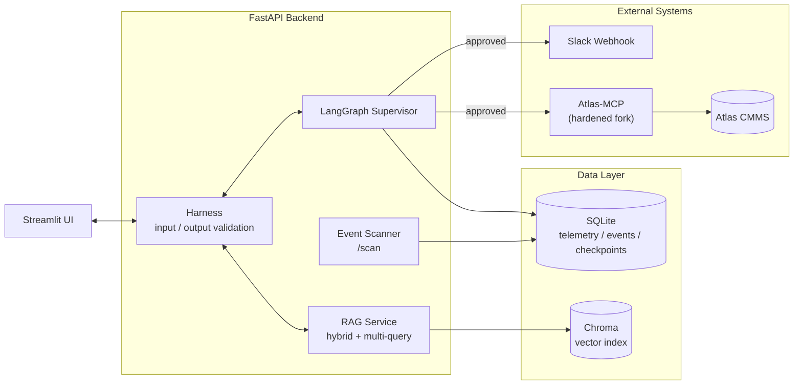
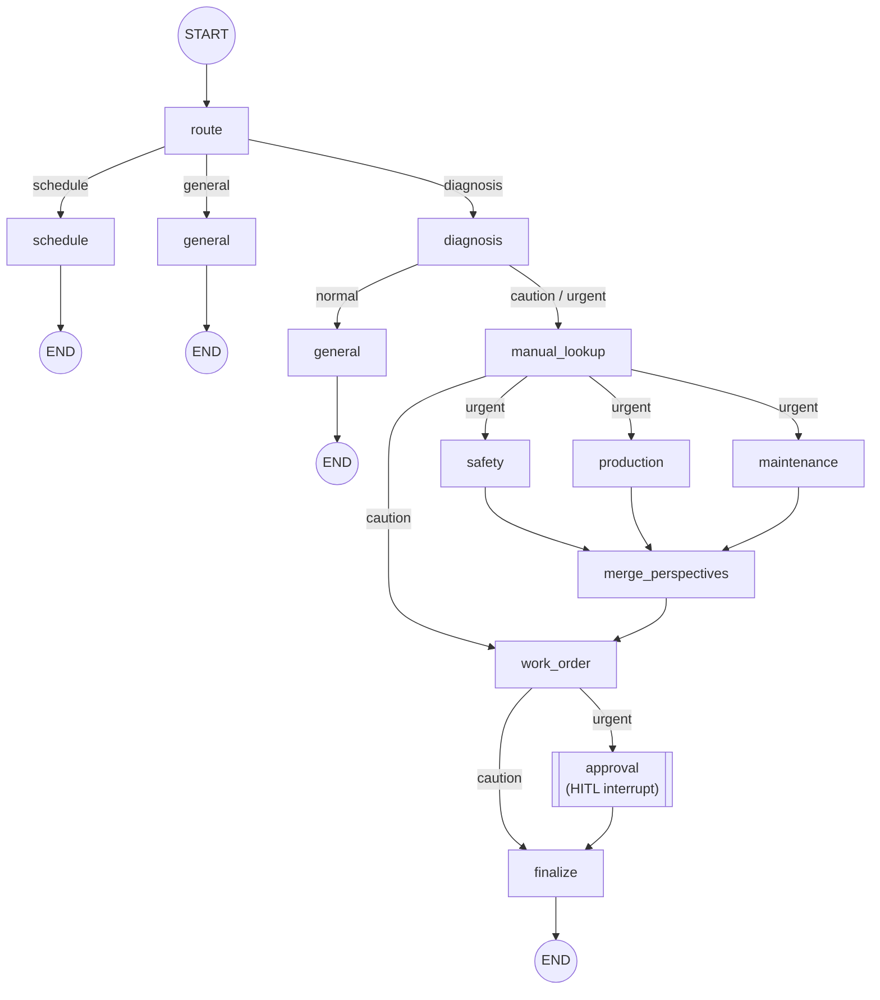
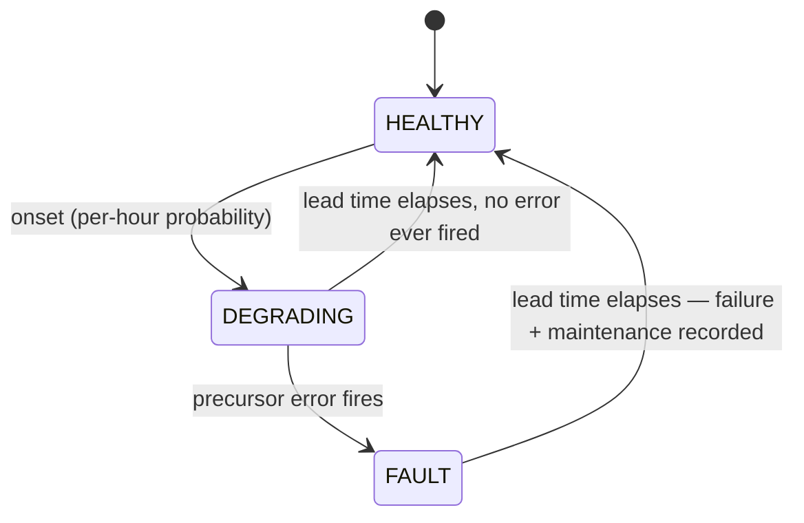

# Uptime Copilot

> A RAG + multi-agent copilot for manufacturing predictive maintenance. It diagnoses
> equipment anomalies from real sensor, error, and maintenance-history data, and routes
> urgent cases through Human-in-the-Loop approval into Slack alerts and CMMS work orders —
> an end-to-end pipeline I designed and built myself.

`FastAPI` · `LangGraph` · `Streamlit` · `RAG (Chroma)` · `SQLite` · `Model Context Protocol` · `Docker Compose` · `pytest`

| | | | |
|---|---|---|---|
| **100** monitored machines | **100%** failure event recall on held-out data (synthetic benchmark — see caveats) | **97–100%** detection precision (vs **6–18%** for the existing Z-score threshold) | **76** regression tests (CI-enforced) |

---

## 01 · Overview — What and why

Built on the Azure Predictive Maintenance dataset (100 machines, ~870k telemetry rows, plus
error, maintenance, and failure records), the goal was a copilot that, when equipment
misbehaves, diagnoses it with evidence and — when action is needed — carries the case through
approval into the tools a plant actually uses (Slack, a CMMS).

> **Core design principle: "Code states the facts; the LLM only interprets."**
> Diagnostic evidence (error logs, Z-score anomalies, actual replacement history) and
> standard repair procedures are all fetched deterministically from the DB/code. The LLM is
> involved only where judgment is needed — routing, summarization, multi-perspective
> assessment. Because the LLM never re-words the work-order text, there is structurally no
> room for it to distort facts (hallucinate) in the output.

## 02 · Architecture

A Streamlit frontend calls the FastAPI backend. The backend passes every model input/output
through a Harness (a deterministic validation layer) before delegating to the LangGraph
supervisor and the RAG service. State (telemetry, events, HITL checkpoints) lives in SQLite,
document embeddings in Chroma, and only approved urgent cases propagate — deterministically —
to Slack and Atlas CMMS (via MCP).

*Figure 1 — Service boundaries and data flow*

## 03 · Core Logic

### Three-tier severity model

Every diagnosis resolves to one of three levels, and the level changes the path through the graph.

| Level | Basis | What happens next |
|---|---|---|
| 🟢 **일반** (normal) | No anomaly | Answer directly, no further action |
| 🟡 **주의** (caution) | Telemetry Z-score anomaly — not yet a confirmed failure | Generate a work order and finalize immediately (no approval) |
| 🔴 **긴급** (urgent) | An actual failure record exists in `PdM_failures.csv` | Three parallel perspective assessments (safety / production / maintenance) → **HITL approval wait** → on approval, propagate to Slack + CMMS |

### LangGraph multi-agent graph

A single `StateGraph` manages everything from routing to approval. Only urgent cases fan out
to three perspective nodes in parallel (results merged via `operator.add`) and pause on
`interrupt()` to wait for a human decision. That approval state is checkpointed with
SqliteSaver, so it survives server restarts.

*Figure 2 — Nodes and edges map 1:1 to the real graph definition in `backend/agent/agent_service.py`*

### RAG · Harness

| Component | Details |
|---|---|
| RAG retrieval | Hybrid BM25 (sparse) + dense-embedding search, with Multi-Query rewriting to expand each question from several angles. Embeddings: `intfloat/multilingual-e5-small`; vector store: Chroma. |
| Faithfulness scoring | After generation, an LLM judge automatically scores how faithful the answer is to the retrieved context (guards against RAG's "plausible but unsupported answer" failure mode). |
| Harness | A deterministic validation layer on every model input/output — regex-based PII checks (computational) combined with LLM-judge quality/faithfulness checks (inferential). |

### Event scanner — evidence-based suppression

`/scan` sweeps all 100 machines without any LLM and stores urgent/caution findings in an
event store. Whether a completed event is allowed to resurface is decided by **whether new
"evidence" has appeared, not by wall-clock time** — a completed event returns only if new
error logs have actually accumulated since completion; otherwise it stays quietly suppressed
no matter how many times you scan.

## 04 · Automated Degradation Simulator

The source dataset is frozen at 2016-01-01 — nothing new ever happens in it unless someone
manually advances a clock. I built a background simulator that runs its own per-machine
state machine and keeps producing new, evolving failures on its own, so the full
diagnose → approve → notify pipeline can run itself, unattended, for a live demo.

*Figure 3 — Per-machine lifecycle, driven by `backend/data/sim_engine.py`*

> **Calibrated against measured reality, not guessed.** The first version used made-up
> numbers. I measured the real dataset instead — 761 failures across 100 machines — and
> rebuilt every constant around what actually happens there: the telemetry deviation at
> failure time averages **1.6σ**, not the 6σ a naive model would climb to; the lead time
> from first drift to failure runs **44–52 hours**; the large majority of failures are
> preceded by *some* error in the prior week, but only a minority of errors are ever
> followed by a failure. The simulator reproduces that same statistical texture instead of
> an easy-to-detect caricature of it.

A single `asyncio` background task, wired into FastAPI's lifespan, advances all 100
machines together (1 real minute ≈ 1 simulated hour), writes to dedicated `sim_*` tables —
structurally separate from the original, read-only dataset — and runs an incremental scan
plus batched Slack alert after every tick. A `threading.Lock` serializes each tick against
operator-triggered actions (force-inject, reset) so the two can't race on the same
100-row state table.

## 05 · Failure Risk Prediction — replacing a threshold tuned on inflated demo data

The simulator (§04) makes failures visible on demand for a demo. That's separate from
whether the app's actual detection logic — a 3σ Z-score threshold — catches anything on
data that isn't artificially inflated. I measured it against the real archive distribution
first, rather than assume: per-sample, only ~1.2% of the real drift ever crosses 3σ, against
15% in the demo's inflated version — the threshold wasn't wrong on its face, it was tuned
against a signal the underlying dataset rarely actually produces.

So I built a real detector: four per-component LightGBM classifiers, trained and evaluated
on a strict time split (no random splitting — adjacent 3-hour samples share heavily
overlapping features, so a random split leaks — confirmed in the cross-review below).

| Component | Event recall (model) | Event recall (Z-score baseline) | Precision, per 3h sample (model) | Precision, per 3h sample (baseline) |
|---|---|---|---|---|
| comp1 | 100% | 73.3% | 96.7% | 17.5% |
| comp2 | 100% | 86.7% | 100.0% | 14.3% |
| comp3 | 100% | 100.0% | 99.3% | 6.0% |
| comp4 | 100% | 96.2% | 99.5% | 9.6% |

*Event recall = did the model flag the actual failure at least once in the 24h before it
happened, on held-out Nov–Dec test data never seen during training. Precision = of the
individual 3-hour samples flagged positive, how many were genuinely inside a real
pre-failure window — same test period and same models, counted per-sample instead of
per-event.*

**On event recall the baseline is already decent** — 73–100%, tied outright on comp3. The
real gap is precision: the Z-score baseline's individual alerts are 82–94% false positives,
against 0–3% for the model, at a mean lead time of 19.5–21.0h within the 24h prediction
window. That's the actual claim here — not "the baseline catches nothing," but "the
baseline drowns a real signal in false alarms, and the model doesn't."

**Separately**, I re-ran the demo-vs-reality gap through the simulator itself, not just the
archive data, as a second, independent check (the model was never run against this
particular simulated data, so this isn't a model-vs-baseline result — it's a check on the
Z-score threshold alone). Monte Carlo-simulating 8,760 hours × 100 machines through the
actual simulator code, with the demo's "strong episode" knob (`STRONG_FRACTION`) turned
off:

| Mode | `STRONG_FRACTION` | Z-score detection rate |
|---|---|---|
| Demo (shipped default) | 0.15 | 15.45% |
| De-inflated to real levels | 0 | 0.00% |

Zero isn't a rounding artifact — it's exact by construction (normal drift is clipped below
3σ, strong drift starts above it) — and it lines up with what measuring the real archive
data separately predicted (~1.2%, above).

> **Caveat:** near-perfect scores are unusual for real-world predictive maintenance.
> Cross-review (below) ruled out data leakage; the working explanation is that this
> particular public dataset injects degradation cleanly enough to make it an easier
> benchmark than field data. Don't expect this to transfer to noisy real sensor data
> as-is — full discussion in `docs/model_card.md` §8.

<strong>WAR STORY · When the results are too good, that's a bug report, not a win</strong>

First training run: recall and precision near 1.00 on every component — a number I don't
trust from a real-world predictive-maintenance model. Rather than write it up, I ran an
ablation (telemetry-only features scored 0.11 PR-AUC, error+maintenance-only scored 0.69 —
neither alone was suspiciously strong) and then sent the exact feature/label windowing code
to an independent model for cross-review before touching anything else. It found no future-data
leak, and specifically confirmed the trickiest spot (761 failures, 743 with a same-timestamp
maintenance record) was already handled correctly by the label boundary. It did catch three
real refinements — an under-filled window at the start of each machine's data and an
unclamped label window at the end — and I re-ran training after fixing them: the metrics
barely moved, confirming those weren't the cause. Root cause: this specific public dataset
is synthetically generated with unusually clean injected drift patterns — a known property
of it, not a bug in this codebase. Logged in full, including the parts I got wrong on the
first pass, in `docs/decisions.md`.

## 06 · External Integrations — Slack alerts · CMMS work orders (MCP)

Post-approval alerts and work-order creation are not tool calls an agent decides to make on
the fly — they are fixed actions that follow a decision already made. So instead of
`langchain-mcp-adapters` (which hands tool selection to the LLM), I used the MCP Python SDK so
that code calls one predetermined tool (`create-work-order`) directly and deterministically.

> I self-hosted **Atlas CMMS** with Docker Compose and forked and hardened a community MCP
> server (Atlas-MCP): always-on Bearer-token checks, constant-time comparison
> (`timingSafeEqual`) against timing attacks, and a Host-header allowlist
> (`ALLOWED_HOSTS`) against DNS rebinding. I later reused the same pattern to extend the
> uptime-copilot backend's own `TrustedHostMiddleware`.

## 07 · Engineering Notes — Problems I actually hit

A system that looks like it works can, on closer inspection, be quietly returning wrong
values. Six cases where I took it all the way through reproduction, root cause, and fix:

<strong>BUG · Event suppression — "Scanning shows nothing": two clocks were being mixed</strong>

The code compared the completion time (`completed_at`, real wall-clock time) directly against
the evidence time (`evidence_at`, the dataset's own time axis). Urgent events were suppressed
permanently, while caution events resurfaced with no new evidence. I fixed it by carrying
`evidence_at` through the whole pipeline and comparing evidence to evidence only.

<strong>BUG · MCP failure handling — why a rejected CMMS call looked like success</strong>

MCP reports tool-execution failures not as exceptions but as an **`isError` field inside a
successful response**. `_create_work_order()` simply discarded the return value of
`call_tool()`, so even when Atlas rejected the call with a 500 the code exited normally. Two
independent review agents (code quality and pipeline) each flagged it; I reproduced it by
calling with a non-existent assetId, then fixed it.

<strong>INFRA · Container networking — two defenses against the same attack blocked each other</strong>

For the containerized backend to reach a CMMS running on the host it needed
`host.docker.internal`, and that address was rejected by **both** uptime-copilot's own DNS
rebinding defense and Atlas-MCP's Host-header allowlist. Instead of bypassing either, I
registered the exact host in both defenses.

<strong>UX · Measure, don't guess — "line breaks aren't preserved"</strong>

While fixing Slack/CMMS notification readability, I hypothesized that the CMMS screen doesn't
render newlines. I tested even the U+2028 (LINE SEPARATOR) trick by rendering it in headless
Chrome and comparing screenshots, confirmed that text alone cannot solve it, and only then
settled on a separator-based alternative — without modifying another open-source project's
frontend.

<strong>BUG · A function vanished mid-edit, and nothing caught it for 70 minutes</strong>

A function the whole simulator background loop depended on was silently deleted while
hand-editing an unrelated part of the same file. Every tick kept "succeeding" from the
outside — `/simulator/status` reported `running: true` the entire time — because the
resulting exception landed in a bare `except Exception: logger.exception(...)` that just
logged and moved on, with no surfaced count of consecutive failures. It only became visible
as a live 500 in the browser, 70 minutes later. I wrote a test that AST-scans every call
site of that module and asserts the referenced name still exists on it, then added mypy to
CI — the exact class of bug a type checker catches in under a second and a test suite alone
can miss.

<strong>RACE · Two writers, one table, no lock — a forced demo event could silently vanish</strong>

The background tick and the operator-triggered "force a failure now" endpoint both do a
full read-modify-write of the same 100-row simulator state table, from separate threads.
Whichever finished last silently overwrote the other's write — an operator forcing a
failure for a demo could watch it get discarded by a tick landing at the same moment. A
security review surfaced it by reasoning about the two code paths, not by reproducing it
live; I added a `threading.Lock` around both paths and confirmed the fix by deliberately
racing an inject against a tick.

## 08 · Quality & Process — Testing and review

| Item | Details |
|---|---|
| Regression tests | For each bug found I add a pytest test, then **revert to the pre-fix code and confirm the test actually goes red** before restoring the fix — a fixed routine that proves the tests aren't just decorative. 76 run in CI (`pytest tests/ --ignore=tests/test_rag_dedup.py`); 78 total including 2 that need the live embedding model; plus a 40-case real-LLM eval suite excluded from both (costs API tokens — run on demand). |
| Static analysis + CI | ruff and mypy run in GitHub Actions on every push/PR, scoped to the modules under active development — adopted specifically because the "vanished function" bug above is exactly what a type checker catches instantly and a test suite might not. |
| Review-agent process | During development, used nine single-lane review subagents (security / code quality / interface / pipeline & model operations / docs / debugging / build & packaging / performance / test validity) instead of one general reviewer — reviewing code in the same context that wrote it lets defects straight through. That tooling was development-only and isn't part of the shipped repo. |
| Cross-review checkpoints | For decisions where getting it wrong is expensive — the failure-risk model's suspiciously perfect first-pass metrics (§05), the priority-rule design that decides shutdown recommendations — I sent the exact code/data to an independent model for review before shipping, rather than self-certify. Both are logged in full in `docs/decisions.md`, including what the reviews actually found. |
| Observability | LangSmith tracing, with traces anonymized using the same PII regexes before being sent. |

## 09 · LLM Provider Flexibility

The app runs against OpenAI by default, but `LLM_PROVIDER=ollama` switches every LLM call —
routing, extraction, perspective assessments, the RAG judge — to a fully local model via
Ollama's OpenAI-compatible endpoint, no code changes needed. I measured what that switch
actually costs rather than assume it's free: on the same 40-case golden set, a local
Qwen3-8B holds machine-ID extraction and re-ask-when-missing at 100% (identical to cloud),
but router accuracy drops 90.0% → 77.5% and per-call latency goes from ~1.2s to 10–14s. A
spot check outside the golden set also caught the local model producing an internally
contradictory structured output (`risk_level: 중간` alongside `requires_shutdown: true`)
that didn't appear on the cloud model in the same testing — real enough to note, not
severe enough to block the feature. Worth the trade for an air-gapped deployment; not a
drop-in free upgrade.

## 10 · Stack

`FastAPI` `LangGraph` `LangChain` `OpenAI API` `Ollama` `LightGBM` `scikit-learn`
`Streamlit` `SQLite` `Chroma`
`HuggingFace sentence-transformers` `rank_bm25` `Model Context Protocol SDK`
`LangSmith` `Docker / Docker Compose` `pytest / pytest-asyncio` `asyncio`
`ruff` `mypy` `GitHub Actions`

---

Uptime Copilot — Predictive Maintenance Copilot · Case study
