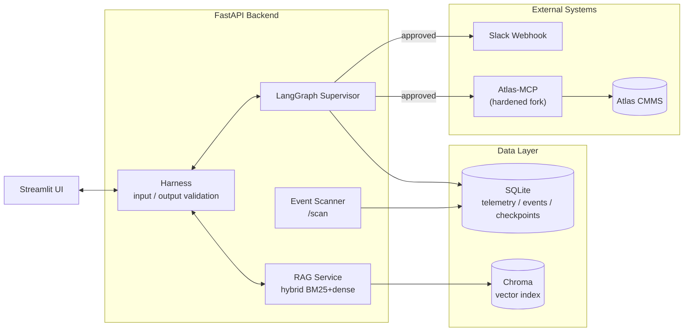
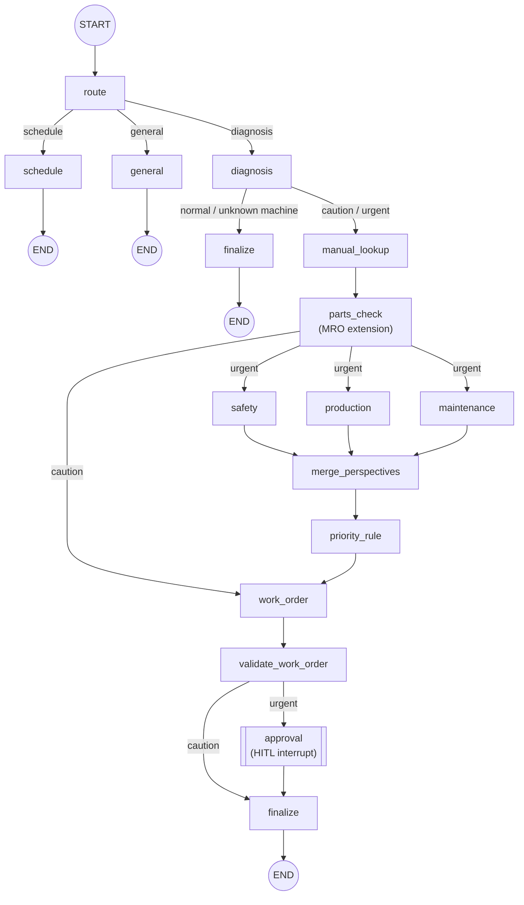
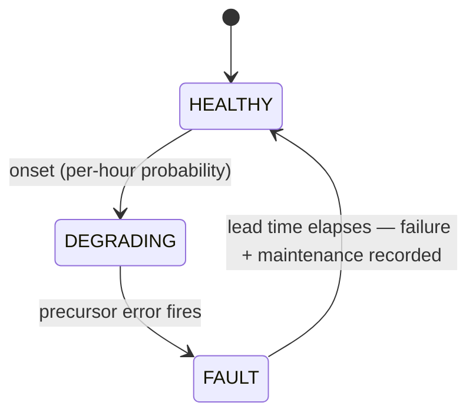

# Uptime Copilot

> A RAG + multi-agent copilot for manufacturing predictive maintenance. It diagnoses
> equipment anomalies from sensor, error, and maintenance-history data (the public Azure PdM
> benchmark, itself simulated), and routes urgent cases through Human-in-the-Loop approval
> into Slack alerts and CMMS work orders — an end-to-end pipeline I designed and built
> myself. Extended with an MRO layer (parts, demand forecast, procurement) and
> closed-network security operations (offline mode, audit log) — §11.

> **Independent project inspired by Hanwha's public materials on TOMMS/HUMS — not affiliated
> with, endorsed by, or built for Hanwha.** Part numbers, stock levels, lead times, costs
> and end-of-life dates are synthetic.

`FastAPI` · `LangGraph` · `Streamlit` · `RAG (Chroma)` · `SQLite` · `Model Context Protocol` · `Docker Compose` · `pytest`

| | | | | |
|---|---|---|---|---|
| **100** monitored machines | **100%** failure event recall on held-out data (synthetic benchmark — see caveats) | **97–100%** detection precision (vs **6–18%** for the existing Z-score threshold) | **222** regression tests (CI-enforced, 227 total) | **0** non-allowlisted TCP connections in the socket-blocked approve-path test (stubbed LLM); startup refuses unsafe endpoints — exact scope in §11 |

---

## 01 · Overview — What and why

Built on the Azure Predictive Maintenance dataset (100 machines, ~870k telemetry rows, plus
error, maintenance, and failure records): a copilot that, when equipment misbehaves,
diagnoses it with evidence and — when action is needed — carries the case through approval
into the tools a plant actually uses (Slack, a CMMS).

> **Core design principle: "Code states the facts; the LLM only interprets."**
> Diagnostic evidence and standard repair procedures are fetched deterministically from the
> DB/code. The LLM is involved only where judgment is needed — routing, summarization,
> multi-perspective assessment. Because it never re-words the work-order text, there's
> structurally no room for it to distort facts in the output.

## 02 · Architecture

A Streamlit frontend calls the FastAPI backend. Every model input/output passes through a
Harness (deterministic validation) before the LangGraph supervisor or RAG service. State
lives in SQLite, document embeddings in Chroma; approved urgent cases propagate to Slack and
Atlas CMMS (via MCP), and the background scan also posts new anomalies to Slack.

```mermaid
flowchart LR
    UI["Streamlit UI"]
    subgraph BE["FastAPI Backend"]
        HN["Harness<br/>input / output validation"]
        SV["LangGraph Supervisor"]
        RS["RAG Service<br/>hybrid BM25+dense"]
        SC["Event Scanner<br/>/scan"]
    end
    subgraph DL["Data Layer"]
        DB[("SQLite<br/>telemetry / events / checkpoints")]
        VS[("Chroma<br/>vector index")]
    end
    subgraph EX["External Systems"]
        SL["Slack Webhook"]
        MC["Atlas-MCP<br/>(hardened fork)"]
        CM[("Atlas CMMS")]
    end

    UI <--> HN
    HN <--> SV
    HN <--> RS
    SV --> DB
    SC --> DB
    RS --> VS
    SV -- "approved" --> SL
    SV -- "approved" --> MC
    MC --> CM
```
*Figure 1 — Service boundaries and data flow*

## 03 · Core Logic

### Three-tier severity model

Every diagnosis resolves to one of three levels, which decides the path through the graph.

| Level | Basis | What happens next |
|---|---|---|
| 🟢 **일반** (normal) | No anomaly | Answer directly, no further action |
| 🟡 **주의** (caution) | Failure-risk-model alarm (Z-score only as the fallback when no model is trained) — not yet a confirmed failure | Generate a work order and finalize immediately (no approval) |
| 🔴 **긴급** (urgent) | An actual failure record exists in `PdM_failures.csv` | Three parallel perspective assessments → **HITL approval wait** → on approval, propagate to Slack + CMMS |

### LangGraph multi-agent graph

A single `StateGraph` manages everything from routing to approval. Only urgent cases fan out
to three perspective nodes in parallel and pause on `interrupt()` for a human decision.
Approval state is checkpointed with SqliteSaver, so it survives server restarts.

```mermaid
flowchart TD
    START(("START")) --> route["route"]
    route -- "diagnosis" --> diagnosis["diagnosis"]
    route -- "schedule" --> schedule["schedule"] --> ENDs(("END"))
    route -- "general" --> general["general"] --> ENDg(("END"))
    diagnosis -- "normal / unknown machine" --> finalize0["finalize"] --> ENDg2(("END"))
    diagnosis -- "caution / urgent" --> manual["manual_lookup"]
    manual --> parts["parts_check<br/>(MRO extension)"]
    parts -- "caution" --> wo["work_order"]
    parts -- "urgent" --> safety["safety"]
    parts -- "urgent" --> production["production"]
    parts -- "urgent" --> maintenance["maintenance"]
    safety --> merge["merge_perspectives"]
    production --> merge
    maintenance --> merge
    merge --> priority["priority_rule"]
    priority --> wo
    wo --> validate["validate_work_order"]
    validate -- "urgent" --> approval[["approval\n(HITL interrupt)"]]
    validate -- "caution" --> finalize["finalize"]
    approval --> finalize
    finalize --> ENDf(("END"))
```
*Figure 2 — Nodes and edges map 1:1 to `backend/agent/agent_service.py`. `parts_check` sits
right after `manual_lookup`, before the urgent/caution branch, since both paths need it.*

### RAG · Harness

| Component | Details |
|---|---|
| RAG retrieval | Hybrid BM25 (sparse) + dense-embedding search. Embeddings: `intfloat/multilingual-e5-small`; vector store: Chroma. Multi-Query rewriting and a Self-RAG necessity check were removed 2026-09-23 — this corpus is too small for either to help measurably. |
| Faithfulness scoring | After generation, an LLM judge scores how faithful the answer is to the retrieved context — guards against RAG's "plausible but unsupported answer" failure mode. |
| Harness | A deterministic layer — input length check, regex PII checks on outputs (computational), LLM-judge faithfulness on RAG answers only (inferential). |

### Event scanner — evidence-based suppression

`/scan` sweeps all 100 machines without any LLM and stores urgent/caution findings. Whether
a completed event resurfaces is decided by **whether new evidence has appeared, not
wall-clock time** — it returns only once new error logs accumulate since completion.

## 04 · Automated Degradation Simulator

The source dataset is frozen at 2016-01-01 — nothing new happens unless a clock is advanced
manually. I built a background simulator with its own per-machine state machine so the full
diagnose → approve → notify pipeline can run itself, unattended, for a live demo.

```mermaid
stateDiagram-v2
    [*] --> HEALTHY
    HEALTHY --> DEGRADING: onset (per-hour probability)
    DEGRADING --> FAULT: precursor error fires
    FAULT --> HEALTHY: lead time elapses — failure + maintenance recorded
```
*Figure 3 — Per-machine lifecycle, driven by `backend/data/sim_engine.py`*

> **Calibrated against measured reality, not guessed.** The first version used made-up
> numbers. I measured the real dataset instead — 761 failures across 100 machines — and
> rebuilt every constant: telemetry deviation at failure time averages **1.6σ**, not a naive
> 6σ; lead time from first drift to failure runs **44–52 hours**; most failures are preceded
> by *some* error in the prior week, but only a minority of errors are ever followed by one.
> The simulator reproduces that statistical texture instead of an easy-to-detect caricature.

A single `asyncio` background task advances all 100 machines together (1 real minute ≈
1 simulated hour), writes to dedicated `sim_*` tables, and runs an incremental scan plus
batched Slack alert after every tick. A `threading.Lock` serializes each tick against
operator-triggered actions so they can't race on the same state table.

## 05 · Failure Risk Prediction — replacing a threshold tuned on inflated demo data

The simulator (§04) makes failures visible on demand. That's separate from whether the app's
actual detection logic — a 3σ Z-score threshold — catches anything on data that isn't
artificially inflated. Measured against the real archive: only ~1.2% of real drift ever
crosses 3σ, against 15% in the demo's inflated version — the threshold wasn't wrong on its
face, it was tuned against a signal the dataset rarely produces.

So I built a real detector: four per-component LightGBM classifiers, trained and evaluated
on a strict time split (random splitting leaks — adjacent 3-hour samples share heavily
overlapping features, confirmed in the cross-review below).

| Component | Event recall (model) | Event recall (Z-score baseline) | Precision, per 3h sample (model) | Precision, per 3h sample (baseline) |
|---|---|---|---|---|
| comp1 | 100% | 73.3% | 96.7% | 17.5% |
| comp2 | 100% | 86.7% | 100.0% | 14.3% |
| comp3 | 100% | 100.0% | 99.3% | 6.0% |
| comp4 | 100% | 96.2% | 99.5% | 9.6% |

*Event recall = did the model flag the actual failure at least once in the 24h before it,
on held-out Nov–Dec data never seen in training. Precision = of individual 3-hour samples
flagged positive, how many were genuinely inside a real pre-failure window.*

**On event recall the baseline is already decent** — 73–100%, tied on comp3. The real gap is
precision: the baseline's alerts are 82–94% false positives, against 0–3.3% for the model,
at a mean lead time of 19.5–21.0h. The claim isn't "the baseline catches nothing" — it's
"the baseline drowns a real signal in false alarms, and the model doesn't."

**Separately**, I re-ran the demo-vs-reality gap through the simulator itself (not the
archive data), as an independent check of the Z-score threshold alone. Monte Carlo–
simulating 8,760 hours × 100 machines with the demo's "strong episode" knob turned off:

| Mode | `STRONG_FRACTION` | Z-score detection rate |
|---|---|---|
| Demo (shipped default) | 0.15 | 15.45% |
| De-inflated to real levels | 0 | 0.00% |

Zero is exact by construction (normal drift is clipped below 3σ), and it matches what the
archive measurement predicted (~1.2%, above).

> **Caveat:** near-perfect scores are unusual for real-world predictive maintenance.
> Cross-review ruled out data leakage; the working explanation is that this public dataset
> injects degradation more cleanly than field data would. Don't expect this to transfer to
> noisy real sensor data as-is — full discussion in
> `docs/model_card.md` §8.

<strong>WAR STORY · When the results are too good, that's a bug report, not a win</strong>

First run: recall and precision near 1.00 on every component — not a number I trust from a
real predictive-maintenance model. Before writing it up, I ran an ablation (telemetry-only
scored 0.11 PR-AUC, error+maintenance-only scored 0.69 — neither alone was suspiciously
strong) and sent the feature/label windowing code for independent cross-review. It found no
future-data leak, and confirmed the trickiest spot (761 failures, 743 with a same-timestamp
maintenance record) was already handled correctly by the label boundary. It did catch two
real fixes (an under-filled window at the start of each machine's data and an unclamped
label window at the end) plus a comment correction, and the metrics barely moved after fixing them,
confirming those weren't the cause. Root cause: this dataset injects unusually clean drift
patterns, a known property of it, not a bug here. Full log, including what I got wrong on
the first pass, in `docs/decisions.md`.

## 06 · External Integrations — Slack alerts · CMMS work orders (MCP)

Post-approval alerts and work orders are fixed actions following a decision already made,
not tool calls an agent decides on the fly. So instead of `langchain-mcp-adapters` (which
hands tool selection to the LLM), I used the MCP Python SDK directly: code calls one
predetermined tool (`create-work-order`) deterministically.

> I self-hosted **Atlas CMMS** with Docker Compose and forked and hardened a community MCP
> server (Atlas-MCP): always-on Bearer-token checks, constant-time comparison against timing
> attacks, and a Host-header allowlist against DNS rebinding — later reused for the
> uptime-copilot backend's own `TrustedHostMiddleware`.

## 07 · Engineering Notes — Problems I actually hit

A system that looks like it works can quietly return wrong values. Six cases taken all the
way through reproduction, root cause, and fix:

<strong>BUG · Event suppression — "Scanning shows nothing": two clocks were being mixed</strong>

The code compared completion time (real wall-clock) directly against evidence time (the
dataset's own time axis). Urgent events were suppressed permanently; caution events
resurfaced with no new evidence. Fixed by carrying `evidence_at` through the whole pipeline
and comparing evidence to evidence only.

<strong>BUG · MCP failure handling — why a rejected CMMS call looked like success</strong>

MCP reports tool-execution failures as an **`isError` field inside a successful response**,
not an exception. `_create_work_order()` discarded `call_tool()`'s return value, so even a
500 from Atlas exited normally. Two independent review agents flagged it; reproduced with a
non-existent assetId, then fixed.

<strong>INFRA · Container networking — two defenses against the same attack blocked each other</strong>

The containerized backend needed `host.docker.internal` to reach a host-side CMMS, and that
address was rejected by **both** uptime-copilot's DNS-rebinding defense and Atlas-MCP's
Host-header allowlist. Fixed by registering the exact host in both, not bypassing either.

<strong>UX · Measure, don't guess — "line breaks aren't preserved"</strong>

While fixing Slack/CMMS readability, I hypothesized the CMMS screen doesn't render newlines.
Tested the U+2028 trick in headless Chrome with screenshot comparison, confirmed text alone
can't solve it, and settled on a separator-based alternative without touching another
project's frontend.

<strong>BUG · A function vanished mid-edit, and nothing caught it for 70 minutes</strong>

A function the simulator loop depended on was silently deleted while hand-editing an
unrelated part of the same file. Every tick kept "succeeding" externally —
`/simulator/status` reported `running: true` throughout — because the exception landed in a
bare `except Exception: logger.exception(...)`. It surfaced as a live 500 in the browser, 70
minutes later. I added a test that AST-scans every call site for the referenced name, and
added mypy to CI — the exact bug class a type checker catches in under a second.

<strong>RACE · Two writers, one table, no lock — a forced demo event could silently vanish</strong>

The background tick and the operator's "force a failure now" endpoint both read-modify-write
the same state table from separate threads; whichever finished last silently overwrote the
other. A security review found it by reasoning about the two code paths, not by reproducing
it live. Fixed with a `threading.Lock`, confirmed by deliberately racing them.

## 08 · Quality & Process — Testing and review

| Item | Details |
|---|---|
| Regression tests | For each bug found I add a test, then **revert the fix and confirm it goes red** before restoring it — proves the tests aren't decorative. 222 run automatically in CI on every push to main and every PR, including the `pytest-socket` offline suite (§11). 227 total; the difference is a real-LLM golden-set eval (kept opt-in, costs API tokens) and 2 tests needing the live embedding model. |
| Static analysis + CI | ruff and mypy on every push/PR — adopted specifically because the "vanished function" bug is exactly what a type checker catches instantly. |
| Review-agent process | Nine single-lane review subagents (security / code quality / interface / pipeline & model ops / docs / debugging / build & packaging / performance / test validity) instead of one general reviewer — reviewing code in the same context that wrote it lets defects through. Agent definitions are checked into `.claude/agents/`. |
| Cross-review checkpoints | For expensive-to-get-wrong decisions — the risk model's suspiciously perfect first-pass metrics (§05), the priority-rule design behind shutdown recommendations — I sent the code/data for independent review rather than self-certify. Both logged in full in `docs/decisions.md`. |
| Observability | LangSmith tracing, with traces anonymized using the same PII regexes before being sent. |

## 09 · LLM Provider Flexibility

`LLM_PROVIDER=ollama` switches every LLM call — routing, extraction, perspective
assessments, the RAG judge — to a fully local model, no code changes needed. I measured what
that actually costs, and caught my own first measurement being unfair before publishing: an
earlier pass compared one local run against one stale cloud run that hadn't gone through the
current safety net. The numbers below are a clean rerun — cloud once with current code,
local 5 times, both split into the 40 safety-net questions and a 10-question holdout never
used to tune it.

| Metric | Cloud (1 run) | Local Qwen3-8B (5 runs) |
|---|---|---|
| Router accuracy (40-question golden set) | 90.0% | 87.5–92.5% (mean 91.0%) |
| Router accuracy (10-question holdout) | 100.0% | 90–100% (mean 96.0%) |
| Machine-ID extraction / re-ask on missing ID | 100.0% / 100.0% | 100.0% / 100.0% |
| Dangerous misroute (named machine → ungrounded node) | 0 | 0 (across all 10 runs) |
| Mean latency / call | ~1.2s | ~13s |

(Local: Qwen3-8B on Apple Silicon, no GPU acceleration beyond Metal; 16GB unified memory
already runs close to its limit with Docker Desktop and this app's own containers running,
the likely cause of occasional ~40s outliers under memory pressure.)

Extraction and re-ask matched cloud from the start — narrow, closed-form tasks. Routing
initially trailed by double digits and ran ~10x slower as two separate calls; both gaps
were narrowed on the code side, not with a bigger model — routing closed to parity, latency
roughly halved but remains ~10x: merging routing+extraction into one
structured-output call, and a deterministic post-classification check for the specific
phrasings the local model kept misrouting into the ungrounded free-chat node. A spot check
outside the golden set also caught the local model producing an internally contradictory
output (`risk_level: 중간` with `requires_shutdown: true`) that cloud never did — fixed
structurally by deriving `requires_shutdown` in code instead of letting the model set it.
Local now matches cloud on accuracy (91.0% vs 90.0%) with zero dangerous misroutes across
all runs; the remaining real cost is latency, mitigated by call-merging and a warm-up ping
but not eliminated. Worth it for a closed environment — not a drop-in free upgrade.

## 10 · Stack

`FastAPI` `LangGraph` `LangChain` `OpenAI API` `Ollama` `LightGBM` `scikit-learn`
`Streamlit` `SQLite` `Chroma`
`HuggingFace sentence-transformers` `rank_bm25` `Model Context Protocol SDK`
`LangSmith` `Docker / Docker Compose` `pytest / pytest-asyncio` `pytest-socket` `asyncio`
`ruff` `mypy` `GitHub Actions`

## 11 · MRO Extension — Parts, Inventory, and Security Operations

The predictive-maintenance core answers "is this machine failing?" A real MRO (Maintenance,
Repair, Operations) workflow also needs "do we have the part?" — plus what a closed-network
deployment needs before it can run there: proof nothing leaks out, and a record of
everything that happened. The parts master itself (numbers, stock, lead times, EOL date) is
entirely synthetic, disclosed in the UI and in `docs/design/parts_assumptions.md`; the
demand forecast's replacement rates and its backtest below are computed from real Azure PdM
data, the same source as §05 above. See §0-1 of
[mro-copilot-upgrade-plan.md](../mro-copilot-upgrade-plan.md) for why this is a separate
extension rather than folded into the core numbers above.

| Component | What it does |
|---|---|
| Parts master + demand forecast | 5 synthetic parts, 30/90-day forecast split into a preventive term and a failure term, backtested against real Nov–Dec 2015 replacement counts: -5.0% to +3.5% error (validates the base rates; the alarm term adds only 0–2 of ~120 units) |
| Inventory-risk dashboard | `GET /parts/inventory_risk` — distinguishes a genuine risk (lead time exceeds the horizon) from a normal reorder signal |
| Procurement urgency, kept separate from priority | A missing part doesn't inflate urgency; it's its own line on the work order, from the same deterministic function the background scanner uses |
| Offline mode | A configured-endpoint allowlist, validated at startup and at CMMS call time: refuses to start on an unknown `OFFLINE` value, an unsafe provider, an endpoint outside the allowlist, an ambiguous URL, or a proxy that would reroute an allowlisted host; forces `HF_HUB_OFFLINE`/disables tracing before anything else imports (holds for the `main.py` entry point only). CI runs `pytest-socket` over a diagnose→approve scenario with a *stubbed LLM and stubbed diagnosis*. **Not proven**: proxy/DNS/redirect routing (proxies refused at startup instead), and CI doesn't exercise startup or RAG init (verified separately, sockets blocked) |
| Audit log | Every LLM-using step (failures included), the parts lookup, approvals/rejections, and Slack/CMMS pushes with their real outcome, correlated by thread ID; a retried call and a RAG answer plus its judge each show as one row. **Not audited**: diagnosis data lookups and the scan's parts lookups. Free text is PII-masked by pattern only — names/addresses aren't detectable |

<strong>WAR STORY · A statistics bug that only showed up as the wrong kind of wrong, twice</strong>

The first demand formula applied a single alarm-conditioned failure rate across the entire
30/90-day window. It looked reasonable and was subtly wrong: the model's precision is high
enough that the "no alarm today" rate is effectively zero in validation data, so applying it
across the whole window claims a machine with no alarm today stays safe for 90 days — a
claim the model (which only knows the next 24h) doesn't support. Swapping to the correct
conditional rate seemed obvious, and produced the opposite bug: 22–32% underprediction,
caught immediately by the backtest I'd already built. The rate wasn't wrong, its *scope*
was: today needs the conditional rate, every day after needs the population rate. Splitting
day-1 from day-2-onward fixed both. Full log, including the failed first attempt, in
`docs/decisions.md`.

<strong>BUG · A synthetic scarcity demo that only worked by coincidence</strong>

One part was deliberately seeded with low stock for a procurement-shortage demo. Widening a
different part's random-number range shifted the shared RNG's draw sequence and silently
flipped the demo part back to "not actually short" — the shortage had never been guaranteed
by design, just a lucky roll under one seed. Fixed by narrowing that part's own range so the
condition holds regardless of what else draws from the generator first.

<strong>UX · Fixing a document doesn't fix the product — a distinction I needed pointed out to me</strong>

An audit of the plan document turned up a real product gap (two parts showing a 90-day
shortfall in the same visual tone as a genuinely urgent one, when their lead time meant they
weren't actually at risk), and I corrected the *documentation* to describe it as unresolved
— then reported that as if it were the fix. It wasn't; the on-screen tab still read the same
way to a user. A direct question — "is that also resolved?" — separated "the record is
accurate" from "the thing it describes changed." Fixed by branching the UI on the
coverability flag the backend already computed.

<strong>INFRA · Two pytest-socket functions with overlapping names, opposite designs</strong>

`disable_socket()` and `socket_allow_hosts()` look composable — call both, get "block
everything except this allowlist." They aren't: `disable_socket()` replaces `socket.socket`
and unconditionally blocks `getaddrinfo` before the allowlist check ever runs. Reading the
plugin's source showed the supported combination is the `allow_hosts` marker alone.
Switching to that made the allowlist test pass for the right reason.

<strong>GAP · The most safety-relevant log lines were the ones with no thread ID</strong>

After wiring six audit-log call sites, a live end-to-end run filtered to one thread ID was
missing all three safety/production/maintenance risk assessments — the shared assessment
function had never taken a `thread_id` parameter. Querying one real scenario end to end,
rather than trusting that six connected call sites meant six usable log lines, is what
surfaced it.

<strong>WAR STORY · "Proven with tests" and "enforced" turned out to be two different claims</strong>

Before writing this section, I sent the whole M2 milestone for cross-review instead of
self-certifying it. It found that the offline guard's DoD — "zero disallowed network calls,
proven" — was true of what the tests checked, but the runtime had no equivalent enforcement:
`LLM_PROVIDER=Ollama` (one capital letter off) silently resolved to the real OpenAI API;
`cmms_client.py` never referenced the allowlist at all; `HF_HUB_OFFLINE` was never actually
set. Separately, the audit log's "every call is recorded" claim was true of the call sites
that existed, but `cmms_client.push_work_order()` returned the same `None` whether it sent
successfully, was never configured, or was blocked — and the logging code treated "no
exception" as "success" in all three cases. I reproduced each bug against the running
container before fixing anything, then fixed the runtime enforcement, the audit accuracy,
and this section's own doc claims — catching two more real errors *in this case study* while
writing the correction (Multi-Query, removed from the code 2026-09-23, was still advertised
in eight places across four docs; this section had claimed "all numbers below are
synthetic," when the demand forecast's backtest uses real data, §05). Full findings and fix
log in `docs/decisions.md`.

---

Uptime Copilot — Predictive Maintenance & MRO Copilot · Case study
