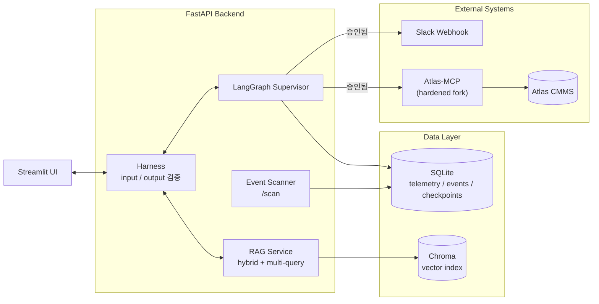
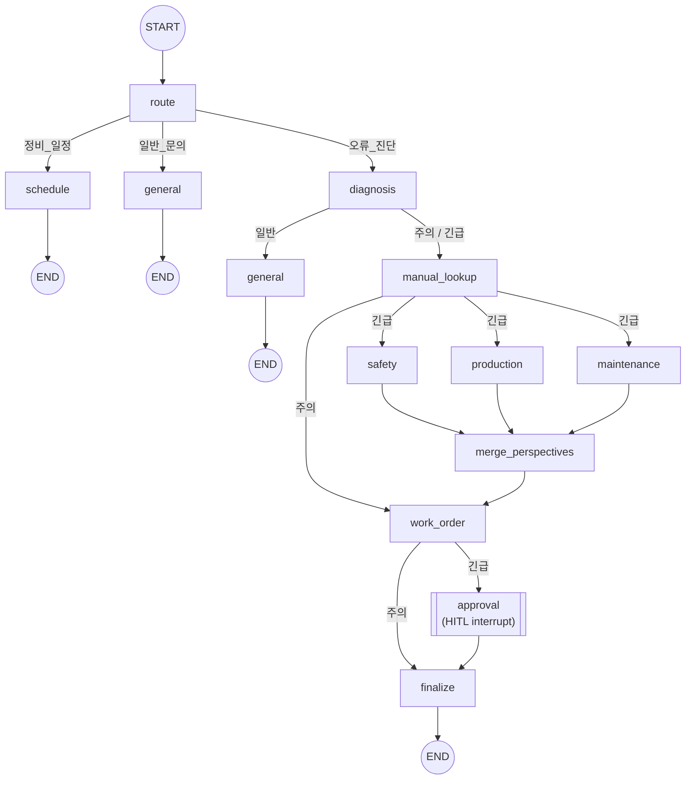
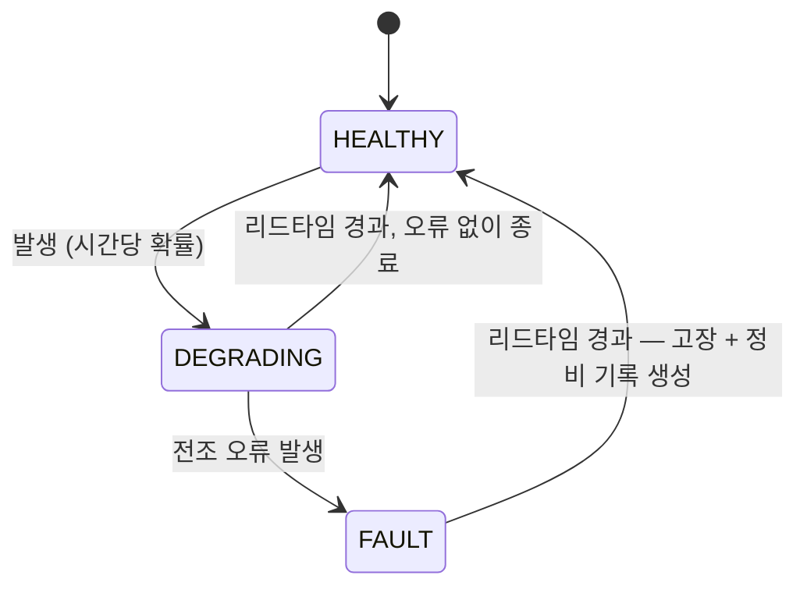

# Uptime Copilot

> 제조 설비 예지보전(Predictive Maintenance)을 위한 RAG + 멀티에이전트 코파일럿.
> 실제 센서/오류/정비 이력 데이터를 근거로 설비 이상을 진단하고, 긴급 사안은
> Human-in-the-Loop 승인을 거쳐 Slack 알림과 CMMS 작업지시서 생성까지 자동으로
> 이어지는 end-to-end 파이프라인을 직접 설계·구현했습니다.

`FastAPI` · `LangGraph` · `Streamlit` · `RAG (Chroma)` · `SQLite` · `Model Context Protocol` · `Docker Compose` · `pytest`

| | | | |
|---|---|---|---|
| **100** 모니터링 설비 수 | **3-tier** 긴급도 판정 모델 | **51** 회귀 테스트 | **9** 전담 코드 리뷰 에이전트 |

---

## 01 · Overview — 무엇을, 왜 만들었나

Azure Predictive Maintenance 데이터셋(설비 100대, 텔레메트리 약 87만 행, 오류/정비/고장
이력 포함)을 기반으로, "설비에 이상이 생기면 근거를 갖고 진단하고, 조치가 필요하면
승인을 거쳐 실제 현장 도구(Slack, CMMS)까지 연결되는" 코파일럿을 목표로 했습니다.

> **핵심 설계 원칙 — "사실은 코드가 말하고, LLM은 해석만 한다."**
> 진단 근거(오류 로그, Z-score 이상치, 실제 교체 이력)와 표준 조치 절차는 전부 결정론적으로
> DB/코드에서 조회하고, LLM은 라우팅·요약·관점 평가처럼 판단이 필요한 부분에만 관여합니다.
> 작업지시서 문구를 LLM이 다시 서술하지 않기 때문에 구조적으로 사실 왜곡(hallucination)이
> 끼어들 자리가 없습니다.

## 02 · Architecture — 시스템 아키텍처

Streamlit 프론트엔드가 FastAPI 백엔드를 호출하고, 백엔드는 모든 모델 입출력을
Harness(결정론적 검증 계층)를 통과시킨 뒤 LangGraph 슈퍼바이저와 RAG 서비스로 위임합니다.
상태(텔레메트리·이벤트·HITL 체크포인트)는 SQLite에, 문서 임베딩은 Chroma에 저장되며,
승인된 긴급 건만 Slack과 Atlas CMMS(MCP)로 결정론적으로 전파됩니다.

*그림 1 — 서비스 경계와 데이터 흐름*

## 03 · Core Logic

### 3단계 긴급도 판정

진단은 항상 아래 세 등급 중 하나로 귀결되고, 등급에 따라 그래프의 경로 자체가 달라집니다.

| 등급 | 판정 근거 | 후속 동작 |
|---|---|---|
| 🟢 **일반** (normal) | 이상 징후 없음 | 바로 답변, 별도 조치 없음 |
| 🟡 **주의** (caution) | 텔레메트리 Z-score 이상치 — 아직 확정 고장은 아님 | 작업지시서 생성 후 바로 확정 (승인 불필요) |
| 🔴 **긴급** (urgent) | `PdM_failures.csv`에 실제 로그된 고장 기록 존재 | 안전/생산/정비 3-관점 병렬 평가 → **HITL 승인 대기** → 승인 시 Slack + CMMS 전파 |

### LangGraph 멀티에이전트 그래프

`StateGraph` 하나로 라우팅부터 승인까지 전 과정을 관리합니다. 긴급 건만
3개 관점 노드를 병렬 실행(`operator.add`로 결과를 머지)하고 `interrupt()`로 멈춰서
사람의 결정을 기다리며, 이 승인 상태는 SqliteSaver로 체크포인트되어 서버 재시작에도
살아남습니다.

*그림 2 — 노드/엣지는 `backend/agent/agent_service.py`의 실제 그래프 정의와 1:1로 대응*

### RAG · Harness

| 구성요소 | 내용 |
|---|---|
| RAG 검색 | BM25(sparse) + Dense 임베딩 하이브리드 검색, Multi-Query 재작성으로 질의를 여러 각도로 확장. 임베딩 모델은 `intfloat/multilingual-e5-small`, 벡터 저장소는 Chroma. |
| Faithfulness 채점 | 답변 생성 후 컨텍스트 대비 사실 충실도를 LLM-judge로 자동 채점 (RAG 특유의 "그럴듯하지만 근거 없는 답변" 문제 대응). |
| Harness | 모든 모델 입출력에 적용되는 결정론적 검증 계층. 정규식 기반 PII 체크(계산적) + LLM-judge 품질/충실도 체크(추론적)를 함께 사용. |

### 이벤트 스캐너 — 근거 기반 억제 로직

`/scan`은 LLM 없이 100대 설비를 전부 훑어 긴급/주의 건을 이벤트 스토어에 저장합니다.
완료 처리된 이벤트가 재감지될지 여부는 **벽시계 시간이 아니라 새로운 "근거"가
나왔는지**로 판단합니다 — 완료 시점 이후 새 오류 로그가 실제로 쌓여야만 다시
표면화되고, 그렇지 않으면 몇 번을 스캔해도 조용히 억제된 채로 남습니다.

## 04 · 자동 열화 시뮬레이터 (Automated Degradation Simulator)

원본 데이터셋은 2016-01-01에 멈춰 있어서, 누군가 수동으로 시계를 돌리지 않는 한
아무 일도 일어나지 않습니다. 그래서 설비별로 독립적인 상태 머신을 돌려 스스로
새로운 고장을 계속 만들어내는 백그라운드 시뮬레이터를 만들었습니다 — 이제
진단 → 승인 → 알림으로 이어지는 전체 파이프라인이 사람 개입 없이도 라이브 데모
동안 스스로 돌아갑니다.

*그림 3 — `backend/data/sim_engine.py`가 구동하는 설비별 열화 생애주기*

> **추측이 아니라 실측 통계로 캘리브레이션.** 처음에는 임의로 정한 값을 썼습니다.
> 대신 실제 데이터셋(설비 100대, 고장 761건)을 직접 측정해서 모든 상수를 실제
> 양상에 맞춰 다시 세웠습니다 — 고장 시점의 텔레메트리 편차는 임의로 가정했던
> 6σ가 아니라 평균 **1.6σ**, 첫 드리프트부터 고장까지의 리드타임은 **44~52시간**,
> 고장 대부분은 그 전 일주일 안에 어떤 오류든 선행하지만 오류 중 실제로 고장으로
> 이어지는 비율은 소수에 불과합니다. 시뮬레이터는 이렇게 쉽게 구분되는 인위적인
> 패턴이 아니라 실측된 것과 같은 통계적 질감을 재현합니다.

`asyncio` 백그라운드 태스크 하나가 FastAPI의 lifespan에 연결되어 설비 100대를
동시에 진행시키고(실제 1분 ≈ 시뮬레이션 1시간), 원본 읽기전용 데이터셋과 구조적으로
분리된 전용 `sim_*` 테이블에 기록하며, 매 틱마다 증분 스캔과 배치 Slack 알림까지
실행합니다. `threading.Lock`으로 각 틱을 운영자가 트리거하는 동작(강제 주입, 리셋)과
직렬화해서 같은 100행짜리 상태 테이블을 두 경로가 동시에 건드리지 못하게 막았습니다.

## 05 · External Integrations — Slack 알림 · CMMS 작업지시서 (MCP)

승인 이후의 알림/작업지시서 생성은 에이전트가 "그때그때 판단해서" 실행하는 도구 호출이
아니라, 이미 결정이 끝난 뒤의 고정된 동작입니다. 그래서 LLM에게 도구 선택을 맡기는
`langchain-mcp-adapters` 대신, MCP Python SDK로 정해진 도구 하나(`create-work-order`)를
코드가 직접, 결정론적으로 호출하도록 설계했습니다.

> **Atlas CMMS**를 Docker Compose로 직접 셀프호스팅하고, 커뮤니티 MCP 서버(Atlas-MCP)를
> 포크해서 하드닝했습니다 — Bearer 토큰 상시 검사, 타이밍 공격 방지용 상수시간 비교
> (`timingSafeEqual`), 그리고 DNS 리바인딩을 막는 Host-헤더 화이트리스트
> (`ALLOWED_HOSTS`) 검사를 추가했습니다. 이 방어 로직은 이후 uptime-copilot 백엔드
> 자체의 `TrustedHostMiddleware` 확장에도 동일한 패턴으로 재사용했습니다.

## 06 · Engineering Notes — 실제로 부딪힌 문제들

겉보기엔 잘 도는 시스템도, 파고들면 조용히 틀린 값을 내고 있는 경우가 있습니다.
그중 재현·근본원인·수정까지 직접 끝까지 판 사례 여섯 가지입니다.

<strong>BUG · 이벤트 억제 로직 — "스캔해도 아무것도 안 뜸", 시간 기준이 섞여 있었다</strong>

완료 시각(`completed_at`, 실제 벽시계 시간)과 증거 시각(`evidence_at`, 데이터셋 자체
시간축)을 그대로 비교하고 있어서, 긴급 이벤트는 영구히 억제되고 주의 이벤트는 새 증거
없이도 재표면화되는 버그였습니다. `evidence_at`을 파이프라인 전체에 걸쳐 보존하고
증거-대-증거로만 비교하도록 고쳐서 해결했습니다.

<strong>BUG · MCP 실패 처리 — CMMS가 거부해도 "성공"으로 착각한 이유</strong>

MCP는 도구 실행 실패를 예외가 아니라 **성공 응답 안의 `isError` 필드**로 보고합니다.
`_create_work_order()`가 `call_tool()`의 반환값을 그냥 버려서, Atlas가 500으로 거부해도
코드는 정상 종료했습니다. 두 개의 독립적인 리뷰 에이전트(코드 품질 / 파이프라인)가
각자 이 문제를 지적했고, 실제로 존재하지 않는 assetId로 호출해 재현한 뒤 고쳤습니다.

<strong>INFRA · 컨테이너 네트워킹 — 같은 버그를 막는 방어벽 두 개가 서로를 막았다</strong>

Docker화된 백엔드가 호스트에서 떠 있는 CMMS에 붙으려면 `host.docker.internal`이
필요했는데, 이 주소가 uptime-copilot 자체의 DNS 리바인딩 방어와 Atlas-MCP의
Host-헤더 화이트리스트, **양쪽 모두**에 막혔습니다. 우회가 아니라 두 방어 로직
모두에 정확한 예외 호스트를 등록하는 방식으로 풀었습니다.

<strong>UX · 실측 기반 의사결정 — "줄바꿈이 안 살아있다", 추측 대신 헤드리스 브라우저로 확인</strong>

Slack/CMMS 알림 가독성 이슈를 고치면서, CMMS 화면이 개행을 렌더링하지 않는다는 가설을
세웠습니다. 이 가설을 근거로 U+2028(LINE SEPARATOR) 트릭까지 실제로 헤드리스 Chrome에
렌더링해 스크린샷으로 비교 검증했고, 텍스트만으로는 해결 불가능함을 확인한 뒤에야
(다른 오픈소스 프로젝트의 프론트엔드를 건드리지 않는 선에서) 구분자 기반의 대안으로
스코프를 확정했습니다.

<strong>BUG · 수정 도중 함수 하나가 사라졌고, 70분 동안 아무도 눈치채지 못했다</strong>

시뮬레이터 백그라운드 루프 전체가 의존하던 함수 하나가, 같은 파일의 다른 부분을
수동으로 고치던 중 조용히 삭제됐습니다. 겉으로는 매 틱이 계속 "성공"하는 것처럼
보였습니다 — `/simulator/status`는 그 70분 내내 `running: true`를 응답했는데, 발생한
예외가 그저 로그만 남기고 넘어가는 `except Exception: logger.exception(...)` 안에서
소리 없이 삼켜지고 있었고, 연속 실패 횟수도 화면에 드러나지 않았기 때문입니다.
브라우저에서 실제 500 에러가 뜨고 나서야 70분 만에 발견됐습니다. 이후
`sim_query` 모듈의 모든 호출부를 AST로 스캔해서 참조하는 이름이 실제로 존재하는지
검증하는 테스트를 추가하고, CI에 mypy를 붙였습니다 — 타입 체커라면 1초도 안 걸려
잡아냈을, 테스트 스위트만으로는 놓치기 쉬운 종류의 버그였습니다.

<strong>RACE · 같은 테이블에 쓰는 두 경로, 락은 없었다 — 강제로 만든 데모 이벤트가 조용히 사라질 수 있었다</strong>

백그라운드 틱과 "지금 강제로 고장을 발생시키는" 운영자용 엔드포인트가 서로 다른
스레드에서 같은 100행짜리 시뮬레이터 상태 테이블을 각각 읽고-수정하고-씁니다.
나중에 끝난 쪽이 먼저 쓴 쪽을 조용히 덮어써서, 데모용으로 강제 주입한 고장이 마침
같은 순간에 돌던 틱에 의해 사라질 수 있었습니다. 실제로 재현해서 찾은 게 아니라
보안 리뷰가 두 코드 경로를 추론만으로 짚어냈고, `threading.Lock`으로 두 경로를
직렬화한 뒤 inject와 tick을 의도적으로 경합시켜 수정을 검증했습니다.

## 07 · Quality & Process — 테스트 · 리뷰 체계

| 항목 | 내용 |
|---|---|
| 회귀 테스트 | 발견한 버그마다 pytest 테스트를 추가하고, **수정 전 코드로 되돌려서 테스트가 실제로 빨간불이 되는지**까지 직접 검증한 뒤 원복 — 형식적인 테스트가 아니라는 걸 증명하는 절차를 고정 루틴으로 사용. 테스트 총 51개. |
| 정적 분석 + CI | ruff와 mypy를 GitHub Actions에 붙여 모든 push/PR마다 실행하고, 실제로 개발 중인 모듈로 범위를 한정했습니다 — 바로 위 "함수가 사라진" 버그가 타입 체커라면 즉시, 테스트 스위트만으로는 놓칠 수 있는 종류였기 때문에 채택했습니다. |
| 전담 리뷰 에이전트 | 보안 / 코드 품질 / 인터페이스 / 파이프라인·모델 운용 / 문서 / 디버깅 / 빌드-패키징 / 성능 / 테스트 유효성, 9개 영역으로 나눠 각자의 관점에서만 리뷰하는 서브에이전트 구성 — 같은 맥락에서 작성한 코드를 같은 맥락에서 리뷰하면 결함이 그대로 통과한다는 전제에서 설계. |
| Observability | LangSmith 트레이싱 연동, PII 정규식을 재사용한 익명화 처리 후 트레이스 전송. |

## 08 · Stack — 기술 스택

`FastAPI` `LangGraph` `LangChain` `OpenAI API` `Streamlit` `SQLite` `Chroma`
`HuggingFace sentence-transformers` `rank_bm25` `Model Context Protocol SDK`
`LangSmith` `Docker / Docker Compose` `pytest / pytest-asyncio` `asyncio`
`ruff` `mypy` `GitHub Actions`

---

Uptime Copilot — Predictive Maintenance Copilot · Case study
