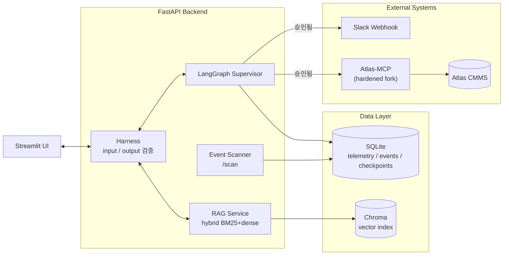
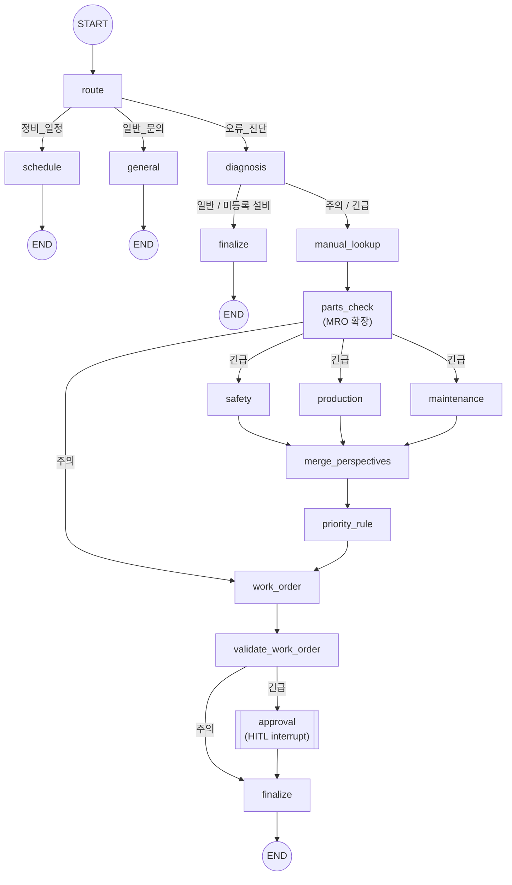
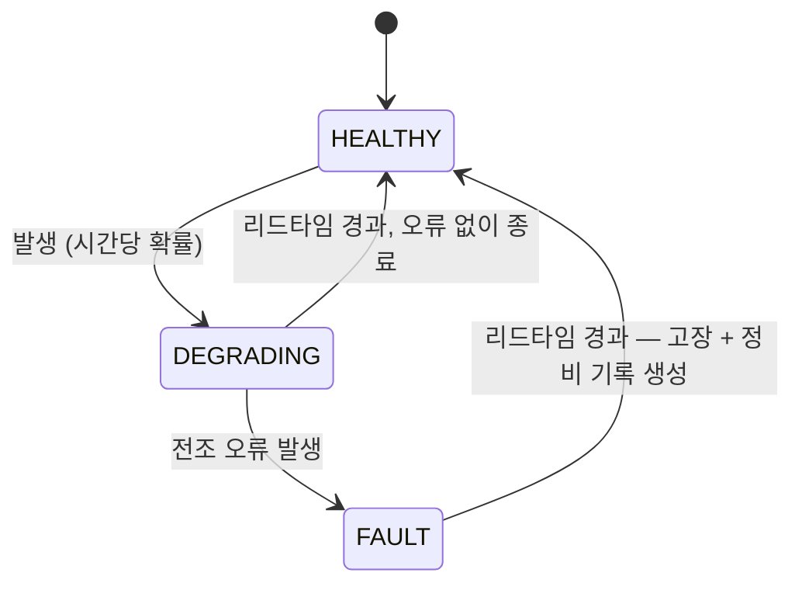

# Uptime Copilot

> 제조 설비 예지보전(Predictive Maintenance)을 위한 RAG + 멀티에이전트 코파일럿.
> 센서/오류/정비 이력 데이터(공개 Azure PdM 벤치마크, 그 자체가 시뮬레이션 데이터)를 근거로 설비 이상을 진단하고, 긴급 사안은
> Human-in-the-Loop 승인을 거쳐 Slack 알림과 CMMS 작업지시서 생성까지 자동으로
> 이어지는 end-to-end 파이프라인을 직접 설계·구현했습니다. MRO 계층(부품·수요예측·
> 조달)과 폐쇄망 보안 운영(오프라인 모드, 감사 로그)으로 확장 — §11.

> **한화 공개 자료(TOMMS/HUMS)에서 착안한 독립 프로젝트** — 한화와 제휴·후원 관계가 없으며 한화를
> 위해 만들어진 것도 아닙니다. 부품번호·재고·리드타임·단가·단종일은 합성값입니다.

`FastAPI` · `LangGraph` · `Streamlit` · `RAG (Chroma)` · `SQLite` · `Model Context Protocol` · `Docker Compose` · `pytest`

| | | | | |
|---|---|---|---|---|
| **100** 모니터링 설비 수 | **100%** 고장 이벤트 재현율 (홀드아웃 테스트, 합성 벤치마크 — 한계 참고) | **97~100%** 탐지 정밀도 (기존 Z-score 임계값 **6~18%** 대비) | **222** 회귀 테스트 (CI 강제, 전체 227개) | **0**건 — 소켓을 막은 승인 경로 테스트(LLM 스텁)에서 허용 목록 밖 TCP 연결. 기동 시 안전하지 않은 엔드포인트는 거부 — 정확한 범위와 증명하지 못한 것은 §11 |

---

## 01 · Overview — 무엇을, 왜 만들었나

Azure Predictive Maintenance 데이터셋(설비 100대, 텔레메트리 약 87만 행, 오류/정비/고장
이력 포함)을 기반으로, "설비에 이상이 생기면 근거를 갖고 진단하고, 조치가 필요하면
승인을 거쳐 실제 현장 도구(Slack, CMMS)까지 연결되는" 코파일럿을 목표로 했습니다.

> **핵심 설계 원칙 — "사실은 코드가 말하고, LLM은 해석만 한다."**
> 진단 근거(오류 로그, Z-score 이상치, 실제 교체 이력)와 표준 조치 절차는 전부 결정론적으로
> DB/코드에서 조회하고, LLM은 라우팅·요약·관점 평가처럼 판단이 필요한 부분에만 관여합니다.
> 작업지시서 문구를 LLM이 다시 서술하지 않기 때문에 구조적으로 사실 왜곡(hallucination)이
> 끼어들 자리가 없습니다.

## 02 · Architecture — 시스템 아키텍처

Streamlit 프론트엔드가 FastAPI 백엔드를 호출하고, 백엔드는 모든 모델 입출력을
Harness(결정론적 검증 계층)를 통과시킨 뒤 LangGraph 슈퍼바이저와 RAG 서비스로 위임합니다.
상태(텔레메트리·이벤트·HITL 체크포인트)는 SQLite에, 문서 임베딩은 Chroma에 저장되며,
승인된 긴급 건이 Slack과 Atlas CMMS(MCP)로 결정론적으로 전파되며, 백그라운드 스캔은 새로 감지한 이상을 Slack에도 올립니다.

```mermaid
flowchart LR
    UI["Streamlit UI"]
    subgraph BE["FastAPI Backend"]
        HN["Harness<br/>input / output 검증"]
        SV["LangGraph Supervisor"]
        RS["RAG Service<br/>hybrid BM25+dense"]
        SC["Event Scanner<br/>/scan"]
    end
    subgraph DL["Data Layer"]
        DB[("SQLite<br/>telemetry / events / checkpoints")]
        VS[("Chroma<br/>vector index")]
    end
    subgraph EX["External Systems"]
        SL["Slack Webhook"]
        MC["Atlas-MCP<br/>(hardened fork)"]
        CM[("Atlas CMMS")]
    end

    UI <--> HN
    HN <--> SV
    HN <--> RS
    SV --> DB
    SC --> DB
    RS --> VS
    SV -- "승인됨" --> SL
    SV -- "승인됨" --> MC
    MC --> CM
```
*그림 1 — 서비스 경계와 데이터 흐름*

## 03 · Core Logic

### 3단계 긴급도 판정

진단은 항상 아래 세 등급 중 하나로 귀결되고, 등급에 따라 그래프의 경로 자체가 달라집니다.

| 등급 | 판정 근거 | 후속 동작 |
|---|---|---|
| 🟢 **일반** (normal) | 이상 징후 없음 | 바로 답변, 별도 조치 없음 |
| 🟡 **주의** (caution) | 고장 위험 모델 경보(학습된 모델이 없을 때만 Z-score 이상치로 대체) — 아직 확정 고장은 아님 | 작업지시서 생성 후 바로 확정 (승인 불필요) |
| 🔴 **긴급** (urgent) | `PdM_failures.csv`에 실제 로그된 고장 기록 존재 | 안전/생산/정비 3-관점 병렬 평가 → **HITL 승인 대기** → 승인 시 Slack + CMMS 전파 |

### LangGraph 멀티에이전트 그래프

`StateGraph` 하나로 라우팅부터 승인까지 전 과정을 관리합니다. 긴급 건만
3개 관점 노드를 병렬 실행(`operator.add`로 결과를 머지)하고 `interrupt()`로 멈춰서
사람의 결정을 기다리며, 이 승인 상태는 SqliteSaver로 체크포인트되어 서버 재시작에도
살아남습니다.

```mermaid
flowchart TD
    START(("START")) --> route["route"]
    route -- "오류_진단" --> diagnosis["diagnosis"]
    route -- "정비_일정" --> schedule["schedule"] --> ENDs(("END"))
    route -- "일반_문의" --> general["general"] --> ENDg(("END"))
    diagnosis -- "일반 / 미등록 설비" --> finalize0["finalize"] --> ENDg2(("END"))
    diagnosis -- "주의 / 긴급" --> manual["manual_lookup"]
    manual --> parts["parts_check<br/>(MRO 확장)"]
    parts -- "주의" --> wo["work_order"]
    parts -- "긴급" --> safety["safety"]
    parts -- "긴급" --> production["production"]
    parts -- "긴급" --> maintenance["maintenance"]
    safety --> merge["merge_perspectives"]
    production --> merge
    maintenance --> merge
    merge --> priority["priority_rule"]
    priority --> wo
    wo --> validate["validate_work_order"]
    validate -- "긴급" --> approval[["approval\n(HITL interrupt)"]]
    validate -- "주의" --> finalize["finalize"]
    approval --> finalize
    finalize --> ENDf(("END"))
```
*그림 2 — 노드/엣지는 `backend/agent/agent_service.py`의 실제 그래프 정의와 1:1로 대응
(2026-09-29: `parts_check`/`priority_rule`/`validate_work_order` 추가 - CP-M2 교차
검토가 이전 버전 도식에서 이 세 노드가 빠져 있음을 발견함. `parts_check`는
`manual_lookup` 바로 뒤, 긴급/주의 분기 전에 있다 - 두 경로 모두 이 정보가
필요하기 때문)*

### RAG · Harness

| 구성요소 | 내용 |
|---|---|
| RAG 검색 | BM25(sparse) + Dense 임베딩 하이브리드 검색. 임베딩 모델은 `intfloat/multilingual-e5-small`, 벡터 저장소는 Chroma. (Multi-Query 재작성과 Self-RAG 검색 필요성 판단은 2026-09-23에 제거됨 - 이 코퍼스 규모에서는 둘 다 측정 가능한 실익이 없었음, `docs/decisions.md` 참고.) |
| Faithfulness 채점 | 답변 생성 후 컨텍스트 대비 사실 충실도를 LLM-judge로 자동 채점 (RAG 특유의 "그럴듯하지만 근거 없는 답변" 문제 대응). |
| Harness | 결정론적 검증 계층. 입력 길이 검사, 출력(작업지시서·답변)에 대한 정규식 기반 PII 체크(계산적), RAG 답변에 한정한 LLM-judge 충실도 체크(추론적). |

### 이벤트 스캐너 — 근거 기반 억제 로직

`/scan`은 LLM 없이 100대 설비를 전부 훑어 긴급/주의 건을 이벤트 스토어에 저장합니다.
완료 처리된 이벤트가 재감지될지 여부는 **벽시계 시간이 아니라 새로운 "근거"가
나왔는지**로 판단합니다 — 완료 시점 이후 새 오류 로그가 실제로 쌓여야만 다시
표면화되고, 그렇지 않으면 몇 번을 스캔해도 조용히 억제된 채로 남습니다.

## 04 · 자동 열화 시뮬레이터 (Automated Degradation Simulator)

원본 데이터셋은 2016-01-01에 멈춰 있어서, 누군가 수동으로 시계를 돌리지 않는 한
아무 일도 일어나지 않습니다. 그래서 설비별로 독립적인 상태 머신을 돌려 스스로
새로운 고장을 계속 만들어내는 백그라운드 시뮬레이터를 만들었습니다 — 이제
진단 → 승인 → 알림으로 이어지는 전체 파이프라인이 사람 개입 없이도 라이브 데모
동안 스스로 돌아갑니다.

```mermaid
stateDiagram-v2
    [*] --> HEALTHY
    HEALTHY --> DEGRADING: 발생 (시간당 확률)
    DEGRADING --> FAULT: 전조 오류 발생
    DEGRADING --> HEALTHY: 리드타임 경과, 오류 없이 종료
    FAULT --> HEALTHY: 리드타임 경과 — 고장 + 정비 기록 생성
```
*그림 3 — `backend/data/sim_engine.py`가 구동하는 설비별 열화 생애주기*

> **추측이 아니라 실측 통계로 캘리브레이션.** 처음에는 임의로 정한 값을 썼습니다.
> 대신 실제 데이터셋(설비 100대, 고장 761건)을 직접 측정해서 모든 상수를 실제
> 양상에 맞춰 다시 세웠습니다 — 고장 시점의 텔레메트리 편차는 임의로 가정했던
> 6σ가 아니라 평균 **1.6σ**, 첫 드리프트부터 고장까지의 리드타임은 **44~52시간**,
> 고장 대부분은 그 전 일주일 안에 어떤 오류든 선행하지만 오류 중 실제로 고장으로
> 이어지는 비율은 소수에 불과합니다. 시뮬레이터는 이렇게 쉽게 구분되는 인위적인
> 패턴이 아니라 실측된 것과 같은 통계적 질감을 재현합니다.

`asyncio` 백그라운드 태스크 하나가 FastAPI의 lifespan에 연결되어 설비 100대를
동시에 진행시키고(실제 1분 ≈ 시뮬레이션 1시간), 원본 읽기전용 데이터셋과 구조적으로
분리된 전용 `sim_*` 테이블에 기록하며, 매 틱마다 증분 스캔과 배치 Slack 알림까지
실행합니다. `threading.Lock`으로 각 틱을 운영자가 트리거하는 동작(강제 주입, 리셋)과
직렬화해서 같은 100행짜리 상태 테이블을 두 경로가 동시에 건드리지 못하게 막았습니다.

## 05 · 고장 위험 예측 — 부풀려진 데모 신호에 맞춰져 있던 임계값을 교체하다

시뮬레이터(§04)는 데모를 위해 고장을 눈에 띄게 만드는 장치입니다. 그런데 앱이 실제로
쓰는 탐지 로직(3σ Z-score 임계값)이, 인위적으로 부풀리지 않은 데이터에서도 뭔가를
잡아내는지는 별개 질문입니다. 추측하지 않고 실측 아카이브 분포로 먼저 측정했습니다 —
표본 하나하나 기준으로, 실제 열화 중 3σ를 넘는 비율은 약 1.2%뿐이었습니다(데모의
부풀린 버전은 15%). 임계값 자체가 틀린 게 아니라, 실제 데이터셋이 좀처럼 만들어내지
않는 강도의 신호에 맞춰져 있었던 겁니다.

그래서 실제로 작동하는 탐지기를 만들었습니다: 부품별 LightGBM 분류기 4개, 엄격한
시간 기준 분할로 학습·평가(무작위 분할 아님 — 인접한 3시간 표본끼리 피처가 크게
겹쳐서 무작위 분할은 누수가 됩니다 — 아래 교차 검토에서 확인됨).

| 부품 | 이벤트 재현율 (모델) | 이벤트 재현율 (Z-score 기준선) | 3h 표본당 정밀도 (모델) | 3h 표본당 정밀도 (기준선) |
|---|---|---|---|---|
| comp1 | 100% | 73.3% | 96.7% | 17.5% |
| comp2 | 100% | 86.7% | 100.0% | 14.3% |
| comp3 | 100% | 100.0% | 99.3% | 6.0% |
| comp4 | 100% | 96.2% | 99.5% | 9.6% |

*이벤트 재현율 = 학습 때 전혀 보지 않은 11~12월 테스트 구간에서, 실제 고장이 나기 24시간
전 구간 안에 모델이 한 번이라도 경보를 냈는가. 정밀도 = 양성으로 표시한 개별 3시간 표본
중 실제로 진짜 고장 직전 구간 안이었던 비율 — 같은 테스트 구간·같은 모델을, 이벤트 단위가
아니라 표본 단위로 다시 센 것.*

**이벤트 재현율만 보면 기준선도 이미 나쁘지 않습니다** — 73~100%, comp3는 아예 동점입니다.
진짜 격차는 정밀도에 있습니다: Z-score 기준선의 개별 경보는 82~94%가 오탐인 반면, 모델은
0~3.3%뿐입니다. 평균 조기경보시간은 24시간 예측 창 안에서 19.5~21.0h. 여기서 하려는 주장은
"기준선은 아무것도 못 잡는다"가 아니라 "기준선은 진짜 신호를 오탐 속에 파묻어버리고,
모델은 그렇지 않다"는 것입니다.

**별개로**, 데모-대-실제 격차를 아카이브 데이터가 아니라 시뮬레이터 자체로도 독립적으로
재확인했습니다(모델은 이 시뮬레이션 데이터로 평가된 적이 없으므로, 이건 모델 대 기준선
비교가 아니라 Z-score 임계값 자체만 따로 보는 검증입니다). 시뮬레이터의 "강한 에피소드"
손잡이(`STRONG_FRACTION`)를 끄고, 실제 `sim_engine.step()` 코드 경로 그대로 8,760시간 ×
설비 100대를 몬테카를로로 돌렸습니다:

| 모드 | `STRONG_FRACTION` | Z-score 탐지율 |
|---|---|---|
| 데모(기존 기본값) | 0.15 | 15.45% |
| 실측 수준으로 낮춤 | 0 | 0.00% |

0%는 반올림 오차가 아니라 설계상 정확한 값입니다(정상 열화는 3σ 아래로 묶여 있고, 강한
열화는 3σ 위에서 시작) — 그리고 아카이브 데이터를 독립적으로 측정했을 때 예측된 값(약
1.2%, 위)과도 일치합니다.

> **한계:** 실무 예지보전 모델에서 이 정도로 거의 완벽한 수치는 흔치 않습니다. 교차 검토
> (아래)로 데이터 누수는 배제했고, 잠정 결론은 이 공개 데이터셋이 열화 패턴을 유독 깨끗하게
> 주입해서 실제 현장 데이터보다 쉬운 벤치마크라는 것입니다. 노이즈 많은 실제 센서 데이터에
> 그대로 옮겨진다고 기대해서는 안 됩니다 — 전체 논의는 `docs/model_card.md` 8절 참고.

<strong>WAR STORY · 결과가 너무 좋으면, 그건 성과 보고가 아니라 버그 신고다</strong>

첫 학습 결과: 모든 부품에서 재현율·정밀도가 거의 1.00 — 실무 예지보전 모델에서 나올 법한
숫자가 아니었습니다. 그대로 정리해 보고하는 대신 ablation부터 돌렸습니다(텔레메트리만 쓰면
PR-AUC 0.11, 오류+정비만 쓰면 0.69 — 어느 쪽도 단독으로는 의심스러울 만큼 강하지 않음).
그다음 피처/라벨 윈도우 계산 코드를 그대로 독립된 모델에 보내 교차 검토를 받은 뒤에야
다음 단계로 넘어갔습니다. 검토 결과 미래 데이터 참조 누수는 없었고, 특히 가장 위험한
지점(고장 761건 중 743건이 같은 시각에 정비 기록도 있음)이 라벨 경계에서 이미 정확히
처리되고 있음을 확인했습니다. 실제로 고칠 점 3가지(설비별 관측 시작 직후 창이 덜 찬
구간, 관측 끝의 라벨 창 미클램핑, 주석 오기)를 찾아냈고, 반영 후 재학습해도 지표는 거의
그대로였습니다 — 그게 원인이 아니었다는 뜻이죠. 결론: 이 정도로 높은 성능은 코드 버그가
아니라, 이 공개 데이터셋 자체가 깨끗하게 주입된 열화 패턴을 갖고 있다는(이미 알려진) 특성
때문입니다. 처음에 제가 잘못 짚었던 부분까지 전부 `docs/decisions.md`에 기록했습니다.

## 06 · External Integrations — Slack 알림 · CMMS 작업지시서 (MCP)

승인 이후의 알림/작업지시서 생성은 에이전트가 "그때그때 판단해서" 실행하는 도구 호출이
아니라, 이미 결정이 끝난 뒤의 고정된 동작입니다. 그래서 LLM에게 도구 선택을 맡기는
`langchain-mcp-adapters` 대신, MCP Python SDK로 정해진 도구 하나(`create-work-order`)를
코드가 직접, 결정론적으로 호출하도록 설계했습니다.

> **Atlas CMMS**를 Docker Compose로 직접 셀프호스팅하고, 커뮤니티 MCP 서버(Atlas-MCP)를
> 포크해서 하드닝했습니다 — Bearer 토큰 상시 검사, 타이밍 공격 방지용 상수시간 비교
> (`timingSafeEqual`), 그리고 DNS 리바인딩을 막는 Host-헤더 화이트리스트
> (`ALLOWED_HOSTS`) 검사를 추가했습니다. 이 방어 로직은 이후 uptime-copilot 백엔드
> 자체의 `TrustedHostMiddleware` 확장에도 동일한 패턴으로 재사용했습니다.

## 07 · Engineering Notes — 실제로 부딪힌 문제들

겉보기엔 잘 도는 시스템도, 파고들면 조용히 틀린 값을 내고 있는 경우가 있습니다.
그중 재현·근본원인·수정까지 직접 끝까지 판 사례 여섯 가지입니다.

<strong>BUG · 이벤트 억제 로직 — "스캔해도 아무것도 안 뜸", 시간 기준이 섞여 있었다</strong>

완료 시각(`completed_at`, 실제 벽시계 시간)과 증거 시각(`evidence_at`, 데이터셋 자체
시간축)을 그대로 비교하고 있어서, 긴급 이벤트는 영구히 억제되고 주의 이벤트는 새 증거
없이도 재표면화되는 버그였습니다. `evidence_at`을 파이프라인 전체에 걸쳐 보존하고
증거-대-증거로만 비교하도록 고쳐서 해결했습니다.

<strong>BUG · MCP 실패 처리 — CMMS가 거부해도 "성공"으로 착각한 이유</strong>

MCP는 도구 실행 실패를 예외가 아니라 **성공 응답 안의 `isError` 필드**로 보고합니다.
`_create_work_order()`가 `call_tool()`의 반환값을 그냥 버려서, Atlas가 500으로 거부해도
코드는 정상 종료했습니다. 두 개의 독립적인 리뷰 에이전트(코드 품질 / 파이프라인)가
각자 이 문제를 지적했고, 실제로 존재하지 않는 assetId로 호출해 재현한 뒤 고쳤습니다.

<strong>INFRA · 컨테이너 네트워킹 — 같은 버그를 막는 방어벽 두 개가 서로를 막았다</strong>

Docker화된 백엔드가 호스트에서 떠 있는 CMMS에 붙으려면 `host.docker.internal`이
필요했는데, 이 주소가 uptime-copilot 자체의 DNS 리바인딩 방어와 Atlas-MCP의
Host-헤더 화이트리스트, **양쪽 모두**에 막혔습니다. 우회가 아니라 두 방어 로직
모두에 정확한 예외 호스트를 등록하는 방식으로 풀었습니다.

<strong>UX · 실측 기반 의사결정 — "줄바꿈이 안 살아있다", 추측 대신 헤드리스 브라우저로 확인</strong>

Slack/CMMS 알림 가독성 이슈를 고치면서, CMMS 화면이 개행을 렌더링하지 않는다는 가설을
세웠습니다. 이 가설을 근거로 U+2028(LINE SEPARATOR) 트릭까지 실제로 헤드리스 Chrome에
렌더링해 스크린샷으로 비교 검증했고, 텍스트만으로는 해결 불가능함을 확인한 뒤에야
(다른 오픈소스 프로젝트의 프론트엔드를 건드리지 않는 선에서) 구분자 기반의 대안으로
스코프를 확정했습니다.

<strong>BUG · 수정 도중 함수 하나가 사라졌고, 70분 동안 아무도 눈치채지 못했다</strong>

시뮬레이터 백그라운드 루프 전체가 의존하던 함수 하나가, 같은 파일의 다른 부분을
수동으로 고치던 중 조용히 삭제됐습니다. 겉으로는 매 틱이 계속 "성공"하는 것처럼
보였습니다 — `/simulator/status`는 그 70분 내내 `running: true`를 응답했는데, 발생한
예외가 그저 로그만 남기고 넘어가는 `except Exception: logger.exception(...)` 안에서
소리 없이 삼켜지고 있었고, 연속 실패 횟수도 화면에 드러나지 않았기 때문입니다.
브라우저에서 실제 500 에러가 뜨고 나서야 70분 만에 발견됐습니다. 이후
`sim_query` 모듈의 모든 호출부를 AST로 스캔해서 참조하는 이름이 실제로 존재하는지
검증하는 테스트를 추가하고, CI에 mypy를 붙였습니다 — 타입 체커라면 1초도 안 걸려
잡아냈을, 테스트 스위트만으로는 놓치기 쉬운 종류의 버그였습니다.

<strong>RACE · 같은 테이블에 쓰는 두 경로, 락은 없었다 — 강제로 만든 데모 이벤트가 조용히 사라질 수 있었다</strong>

백그라운드 틱과 "지금 강제로 고장을 발생시키는" 운영자용 엔드포인트가 서로 다른
스레드에서 같은 100행짜리 시뮬레이터 상태 테이블을 각각 읽고-수정하고-씁니다.
나중에 끝난 쪽이 먼저 쓴 쪽을 조용히 덮어써서, 데모용으로 강제 주입한 고장이 마침
같은 순간에 돌던 틱에 의해 사라질 수 있었습니다. 실제로 재현해서 찾은 게 아니라
보안 리뷰가 두 코드 경로를 추론만으로 짚어냈고, `threading.Lock`으로 두 경로를
직렬화한 뒤 inject와 tick을 의도적으로 경합시켜 수정을 검증했습니다.

## 08 · Quality & Process — 테스트 · 리뷰 체계

| 항목 | 내용 |
|---|---|
| 회귀 테스트 | 발견한 버그마다 pytest 테스트를 추가하고, **수정 전 코드로 되돌려서 테스트가 실제로 빨간불이 되는지**까지 직접 검증한 뒤 원복 — 형식적인 테스트가 아니라는 걸 증명하는 절차를 고정 루틴으로 사용. CI에서는 222개(`pytest tests/ --ignore=tests/test_rag_dedup.py`)가 매 push마다 자동 실행되며, `pytest-socket` 기반 오프라인 네트워크 증명(§11)도 포함됩니다 - 예전엔 "임베딩 모델 캐시가 없어서"라는 이유로 이 스위트를 CI에서 뺐었는데, 교차 검토가 이 스위트는 애초에 임베딩 경로를 전혀 안 건드린다는 걸 발견했습니다. 진짜 제약(Docker 전용 호스트명)은 따로 있었고, 순수 우분투 CI 러너에서도 안 깨지는 걸 직접 확인한 뒤에 다시 포함시켰습니다. 전체는 227개 - 실제 LLM을 호출하는 40문항 골든셋 평가(API 비용 발생, 여전히 선택 실행)와 임베딩 모델이 실제로 필요해 CI의 `--ignore`로만 빠지는 2건입니다. |
| 정적 분석 + CI | ruff와 mypy를 GitHub Actions에 붙여 모든 push/PR마다 실행하고, 실제로 개발 중인 모듈로 범위를 한정했습니다 — 바로 위 "함수가 사라진" 버그가 타입 체커라면 즉시, 테스트 스위트만으로는 놓칠 수 있는 종류였기 때문에 채택했습니다. |
| 리뷰 에이전트 프로세스 | 개발 과정에서 보안 / 코드 품질 / 인터페이스 / 파이프라인·모델 운용 / 문서 / 디버깅 / 빌드-패키징 / 성능 / 테스트 유효성, 9개 영역으로 나눠 각자의 관점에서만 리뷰하는 서브에이전트 9개를 범용 리뷰어 하나 대신 사용 — 같은 맥락에서 작성한 코드를 같은 맥락에서 리뷰하면 결함이 그대로 통과한다는 전제에서 설계. 에이전트 정의 자체는 `.claude/agents/`에 커밋돼 있습니다(2026-09-29 정정 - 예전 버전은 배포된 저장소에 없다고 적었는데, 교차 검토가 `git ls-files`로 직접 확인해 틀렸음을 발견함). |
| 교차 검토 체크포인트 | 잘못되면 비용이 큰 결정(고장 위험 예측 모델의 의심스러울 만큼 완벽했던 초기 지표(§05), 정지 권고를 좌우하는 우선순위 규칙 설계)은 제가 스스로 통과 판정을 내리지 않고, 코드/데이터를 그대로 독립된 모델에 보내 검토받았습니다. 둘 다 검토에서 실제로 무엇이 나왔는지까지 `docs/decisions.md`에 전부 기록되어 있습니다. |
| Observability | LangSmith 트레이싱 연동, PII 정규식을 재사용한 익명화 처리 후 트레이스 전송. |

## 09 · LLM 제공자 유연성

기본은 OpenAI로 돌지만, `LLM_PROVIDER=ollama`로 바꾸면 라우팅·추출·관점 평가·RAG
판정까지 모든 LLM 호출이 코드 수정 없이 완전 로컬 모델(Ollama의 OpenAI 호환
엔드포인트)로 전환됩니다. 이 전환이 실제로 얼마나 비용을 치르는지 추측하지 않고
직접 측정했고, 첫 측정 자체가 공정하지 않았다는 걸 발표 전에 스스로 잡아냈습니다 —
초기 버전은 로컬 1회 실행을 현재 안전장치를 거치지 않은 클라우드 1회 실행과
비교했는데, 외부 검토가 이걸 사과-오렌지 비교(자기 실패 사례에 맞춰 튜닝된 비교)로
지적했습니다. 아래는 재측정한 수치입니다 - 클라우드는 현재 코드로 1회, 로컬은 5회,
둘 다 안전장치를 만드는 데 쓴 40문항과 안전장치 제작 중 한 번도 안 본 별도 10문항
홀드아웃으로 나눠서 측정했습니다.

| 지표 | 클라우드(1회) | 로컬 Qwen3-8B(5회) |
|---|---|---|
| 라우터 정확도(40문항 골든셋) | 90.0% | 87.5~92.5% (평균 91.0%) |
| 라우터 정확도(10문항 홀드아웃) | 100.0% | 90~100% (평균 96.0%) |
| 설비번호 추출 / 번호 없을 때 되묻기 | 100.0% / 100.0% | 100.0% / 100.0% (5회 전부) |
| 위험한 오분류(실제 설비 언급 → 근거 없는 노드) | 0 | 0 (골든+홀드아웃 10회 전체) |
| 호출당 평균 지연 | ~1.2초 | ~13초 |

추출과 되묻기는 처음부터 클라우드와 동일했습니다 - 폭이 좁고 형태가 고정된
작업이라서입니다. 라우팅은 처음엔 두 자릿수 격차로 뒤졌고 라우팅+추출이 별도
호출 두 번이라 약 10배 느렸는데, 둘 다 더 큰 모델이 아니라 코드 쪽에서 좁혔습니다 -
라우팅+추출을 구조화 출력 호출 하나로 합치고, 로컬 모델이 자주 잘못 보내는
특정 표현을 잡아내는 결정론적 후처리 분류 체크를 추가했습니다. 골든셋 범위 밖
스팟 체크에서 로컬 모델이 내부적으로 모순된 구조화 출력(`risk_level: 중간`인데
`requires_shutdown: true`)을 내는 것도 확인했습니다 - 클라우드 모델은 같은
테스트에서 이런 모순이 없었고, `requires_shutdown`을 모델이 정하지 않고 코드에서
유도하도록 구조적으로 고쳤습니다. 결론: 로컬이 이제 정확도에서 클라우드와 같은
범위(91.0% vs 90.0%)이고, 안전 관련 핵심 지표(위험한 오분류)는 전체 실행에서
0건입니다. 남은 진짜 비용은 지연이고, 호출 병합과 워밍업으로 완화는 됐지만
없어지진 않았습니다. 폐쇄망 배포라면 감수할 가치가 있고, 대가 없는 무료
업그레이드는 아닙니다.

## 10 · Stack — 기술 스택

`FastAPI` `LangGraph` `LangChain` `OpenAI API` `Ollama` `LightGBM` `scikit-learn`
`Streamlit` `SQLite` `Chroma`
`HuggingFace sentence-transformers` `rank_bm25` `Model Context Protocol SDK`
`LangSmith` `Docker / Docker Compose` `pytest / pytest-asyncio` `pytest-socket` `asyncio`
`ruff` `mypy` `GitHub Actions`

## 11 · MRO 확장 — 부품·재고와 보안 운영

위 예지보전 코어는 "이 설비가 고장 나고 있는가?"에 답합니다. 실제 MRO(정비·수리·운영)
워크플로우는 "부품이 있는가, 그리고 이게 실제 재고 데이터인 척하지 않고 그렇게 말할 수
있는가?"에도 답해야 합니다 - 그리고 폐쇄망 배포가 돌아가기 전에 실제로 필요한 두 가지,
즉 아무것도 새어나가지 않는다는 증명과 무슨 일이 있었는지의 기록도 필요합니다.
부품 마스터 자체(부품번호·재고·리드타임·단종일)는 전부 합성값이며, 화면과
`docs/design/parts_assumptions.md`에 그렇게 명시돼 있습니다(2026-09-29 정정 -
예전 버전은 "아래 수치 전부"가 합성이라고 적었는데, 교차 검토가 틀렸음을 발견함:
수요 예측의 교체율과 -5.0%/+3.5% 백테스트는 위 §05와 마찬가지로 실제 2015년
11~12월 Azure PdM 데이터로 계산됩니다). 왜 이걸 위 핵심 수치와 섞지 않고 별도
확장으로 다루는지는 [mro-copilot-upgrade-plan.md](../mro-copilot-upgrade-plan.md)
§0-1 참고.

| 구성요소 | 내용 |
|---|---|
| 부품 마스터 + 수요 예측 | 합성 부품 5개, 30/90일 교체 수요를 예방 항과 고장 항으로 분리 예측(아래 참고), 2015년 11~12월 Azure PdM 교체 건수 대비 백테스트 오차 -5.0%~+3.5% (기본 교체율을 검증할 뿐 경보 항은 ~120건 중 0~2건만 더함) |
| 재고 위험 대시보드 | `GET /parts/inventory_risk` - 진짜 위험(리드타임이 예측 기간보다 김)과 정상 재주문 신호(안 그럼)를 구분 |
| 우선순위와 분리된 조달 긴급도 | 부품이 없다고 진단이 더 급해지지 않음 - 백그라운드 스캐너와 같은 결정론 함수가 판단하는, 작업지시서의 별도 줄 |
| 오프라인 모드 | 기동 시점과 CMMS 호출 시점에 검증하는 설정된 엔드포인트 허용 목록: 알 수 없는 `OFFLINE` 값·안전하지 않은 제공자·허용 목록 밖 엔드포인트·모호한 URL·허용 목록 호스트를 프록시로 돌려버릴 프록시 변수가 있으면 기동을 거부하고, 다른 어떤 것보다 먼저 `HF_HUB_OFFLINE` 강제·LangChain 트레이싱 비활성화를 적용(`main.py` 진입점에 한해 성립). CI는 *LLM과 진단을 스텁으로 대체한* 진단→승인 시나리오에 `pytest-socket` 테스트를 실행(Slack은 가드가 스킵, CMMS는 그 시나리오에서 미설정)하고, 기동 검증은 단위 테스트로 확인. **증명하지 못한 것**: `pytest-socket`은 TCP `connect()`만 봐서 프록시·DNS·리다이렉트는 범위 밖이고, CI는 기동과 RAG 초기화를 실행하지 않음(소켓을 막고 따로 확인). 프론트엔드 컨테이너의 공인 IP 조회는 `browser.serverAddress`로 없앴고 흉내 내서만 확인 |
| 감사 로그 | LLM을 쓰는 모든 단계(실패 포함)·부품 조회·승인/반려·Slack/CMMS 전송과 오프라인 차단을 스레드ID로 상관하고, "예외 없음"이 아니라 실제 결과(전송됨/미설정/차단/실패)를 반영하는 값으로 기록. **기록하지 않는 것**: 진단용 데이터 조회와 백그라운드 스캔의 부품 조회이며, 재시도한 호출과 RAG 답변+판정은 각각 한 행. 자유 텍스트는 저장 전에 패턴으로 개인정보를 마스킹(이름·주소는 탐지 불가) |

<strong>WAR STORY · "틀린 방향"이 두 번 바뀐 통계 버그</strong>

수요 예측 공식 초판은 단일 경보-조건부 고장률을 30/90일 예측 창 전체에 그대로
적용했습니다. 그럴듯해 보였지만 놓치기 쉬운 방식으로 틀렸습니다 - 외부 검토가
찾아낸 건, 모델 정밀도가 워낙 높아서 검증 데이터의 "오늘 경보 없음" 고장률이
사실상 0이라는 점이었습니다. 이 값을 예측 창 전체에 그대로 쓰면 "오늘 경보가
없는 설비는 앞으로 90일 내내 안전하다"는 주장이 되는데, 모델이 실제로 보증하는
범위(다음 24시간)를 벗어난 주장입니다. 올바른 조건부 비율로 바꾸는 게 당연한
해법처럼 보였고, 반대 방향의 새 버그를 냈습니다: 22~32% 과소예측, 이미 만들어둔
백테스트가 즉시 잡아냈습니다. 비율 자체가 틀린 게 아니라 **적용 범위**가 틀렸던
겁니다 - 오늘(아는 경보 상태)은 조건부 비율, 그 이후 매일(모르는 미래 경보 상태)은
모집단 비율이 필요했고, 어느 방향으로든 이 둘을 섞으면 깨졌습니다. 1일차와
2일차 이후를 분리하자 두 오류가 한 번에 해결됐습니다. 실패한 1차 시도까지 전부
`docs/decisions.md`에 기록했습니다.

<strong>BUG · 우연으로만 성립했던 합성 재고부족 데모</strong>

부품 하나를 의도적으로 재고 부족 시나리오 데모용으로 낮게 시딩해뒀습니다.
무관한 다른 부품의 난수 범위를 넓히자 공유 RNG의 추출 순서가 밀리면서 데모
부품이 조용히 "재고부족 아님"으로 뒤바뀌었습니다 - 애초에 이 부족 상태는 설계로
보장된 게 아니라 특정 시드 하나에서의 운이었던 겁니다. 다른 부품이 먼저 뭘
뽑아가든 그 조건이 항상 성립하도록, 해당 부품 자신의 범위를 좁혀서 고쳤습니다.

<strong>UX · 문서를 고친다고 제품이 고쳐지는 게 아니다 - 사용자가 직접 짚어준 구분</strong>

계획 문서를 감사하다가 실제 제품 갭(부족분 90일 기준으로 두 부품이 진짜 위험과
시각적으로 똑같은 톤으로 경고를 냈는데, 리드타임을 보면 실제로는 위험하지 않은
경우)을 발견했고, **문서**를 "아직 미해결"이라고 정확하게 고친 뒤 그걸 마치
수정 자체인 것처럼 보고했습니다. 아니었습니다 - 화면의 재고 위험 탭은 실제
사용자에게 여전히 똑같이 읽혔습니다. "그것도 해결된 거냐"는 직접적인 질문이
"기록이 정확해졌다"와 "기록이 설명하는 대상이 실제로 바뀌었다"를 구분해줬습니다.
백엔드가 이미 계산해두던 조달가능 여부 플래그로 화면 분기를 나눠서 - 진짜
위험은 여전히 경고로, 정상 재주문 시점은 그렇게 읽히도록 고쳤습니다.

<strong>INFRA · 이름은 겹치지만 설계는 반대인 pytest-socket 함수 두 개</strong>

`disable_socket()`과 `socket_allow_hosts()`는 같이 쓰면 "허용 목록만 빼고 전부
차단"이 될 것처럼 보입니다. 아닙니다 - `disable_socket()`은 `socket.socket` 자체를
교체하고 `getaddrinfo`를 무조건 막는데, 이게 `socket_allow_hosts()`의 connect
단계 허용 목록 검사가 실행되기도 전에 일어납니다. 문서가 아니라 플러그인 소스
자체(`inspect.getsource`)를 읽어보니, 실제로 지원되는 조합은 `allow_hosts`
마커 하나뿐이었고 이건 `socket_allow_hosts()`만 호출합니다. 그걸로 바꾸자
허용 목록 테스트가 맞는 이유로 통과하기 시작했습니다(전엔 다른 이유로 실패하고
있었던 것).

<strong>GAP · 가장 안전과 관련 있는 로그 줄에 스레드ID가 없었다</strong>

감사 로그 연결 지점 6곳을 다 붙인 뒤, 스레드ID 하나로 필터링해서 실제 시나리오를
끝까지 돌려봤더니 안전/생산/정비 3관점 위험 평가가 통째로 빠져 있었습니다. 이
평가를 공유하는 함수가 애초에 `thread_id`를 파라미터로 안 받고 있었는데, 그
연결 지점을 처음 쓸 때는 이게 그렇게까지 중요할 것 같지 않았기 때문입니다.
"연결 지점 6곳을 붙였으니 로그 6줄이 다 쓸모 있겠지"를 그냥 믿는 대신, 실제
시나리오 하나를 끝까지 조회해본 것이 이 갭을 실제로 드러낸 방법이었습니다.

<strong>WAR STORY · "테스트로 증명됨"과 "강제됨"은 서로 다른 주장이었다</strong>

이 섹션을 쓰기 전에, M2 마일스톤 전체를 자체 판정하지 않고 교차 검토로 보냈습니다
(영역별 리뷰 에이전트 5개를 병렬로 돌리고, 그 결과를 실제 코드와 대조해 종합하는
독립 패스 하나 추가). 검토가 찾아낸 건: 오프라인 가드의 DoD 자체("외부 호출
0회, 증명됨") 는 테스트가 확인하는 범위에서는 맞았지만, 런타임 코드에는 그에
대응하는 강제가 전혀 없었다는 것 - `LLM_PROVIDER=Ollama`(대문자 하나 다름)는
대소문자를 구분하는 모든 비교를 조용히 통과해서 실제로는 Ollama 대신 진짜
OpenAI API로 연결됐고, `cmms_client.py`는 허용 목록을 애초에 참조하지 않아서
`CMMS_MCP_URL`을 잘못 설정하면 그대로 나갔으며, `HF_HUB_OFFLINE`은 어디에도
세팅된 적이 없었습니다. 별개로, 감사 로그의 "모든 호출이 기록된다"는 주장도
존재하는 연결 지점에 대해서는 맞았지만, `cmms_client.push_work_order()`는 실제로
전송에 성공했든, 애초에 설정이 안 됐든, 차단됐든 똑같이 `None`을 반환했고 -
그 결과를 기록하는 코드는 세 경우 모두 "예외 없음"을 "성공"으로 취급했습니다.
아무것도 고치기 전에 전부 직접 재현했고(각 버그를 실제로 돌고 있는 컨테이너에서
독립적으로), 그 다음 런타임 강제·감사 정확성·그리고 지금 이 섹션이 하는 바로 그
문서 주장들을 고쳤습니다 - 고치는 과정에서 **이 케이스 스터디 자체에서** 실제
오류 2건을 더 찾아낸 것도 포함해서(2026-09-23에 코드에서 제거된 Multi-Query
재작성이 문서 4개 8곳에서 여전히 광고되고 있었고, 이 섹션이 "아래 수치는 전부
합성"이라고 적어놓았는데 수요 예측의 백테스트는 §05와 마찬가지로 실제 2015년
데이터를 씁니다). 전체 발견·검증·수정 기록은 `docs/decisions.md`에 있습니다.

---

Uptime Copilot — Predictive Maintenance & MRO Copilot · Case study
